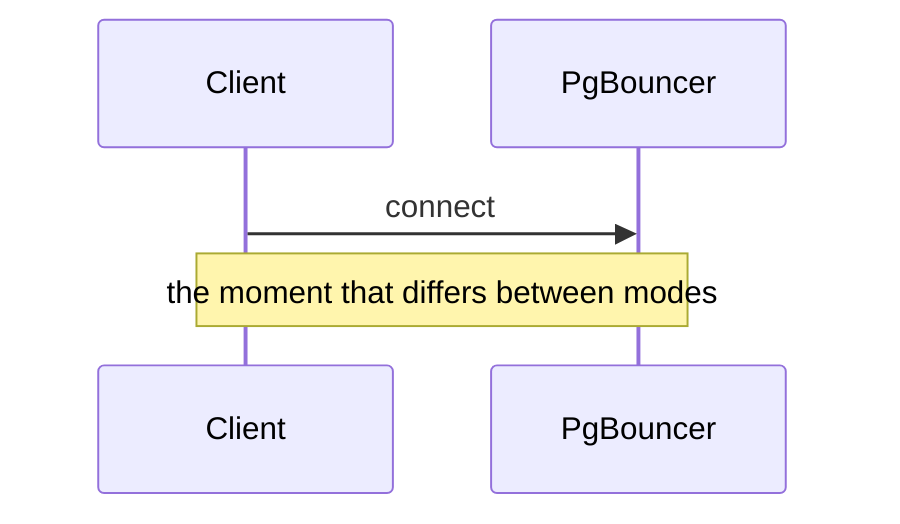

# Voice

Rules derived from the existing archive. The voice gate in `gates.md` checks a draft
against this file, so it must describe what the blog actually sounds like — not a
generic style guide. Daily posts are written in English; the archive's small set of
legacy Vietnamese posts (e.g. `ai-pair-programing-vn`, `starcoder-vn`) are not a voice
model for this pipeline.

## Shape of a daily post

1,000–1,500 words. One idea, one worked example, one takeaway. Deliberately lighter
than the 2,000–3,300 word flagship posts, without being thinner in substance.

- **Cold open on a concrete failure or situation**, not a definition. The archive
  opens posts with lines like "At 02:13, your control plane sneezes" and "There's a
  particular kind of frustration that only backend engineers know". Never open with
  "In today's fast-paced world" or "X is a powerful tool that...". A tutorial-shaped
  post (a setup walkthrough, a version-pinned how-to) may open by naming the concrete
  problem the setup solves instead of a failure scene — but it still opens on a
  specific situation, never a category definition.
- **H2 sections** carrying real claims as headings, not labels. "The failure mode:
  when retry becomes attack" beats "Background".
- **A worked example with runnable code**, commented, in the language the topic
  actually uses. Snippets are short and adapted for a reader to lift.
- **Tradeoffs stated plainly**, including when the thing being described is the wrong
  choice.
- **The post ends with a real "Further reading" section** — a short list of the actual
  sources used, with working links, never invented ones. That heading (some spelling
  of "Further reading", "Further Reading & References", or "References") is
  consistently the *last* section in the archive. A "Key takeaways" section, when the
  post has one, comes immediately *before* it, not after — "Key takeaways" is never
  the final heading of a post. For a daily post's length, one closing section is
  usually enough: fold the takeaway into a short "Key takeaways" list only when the
  post makes more than one distinct claim worth restating; otherwise go straight from
  the last body section into "Further reading".

### What counts toward the word count

The 1,000–1,500 range counts **prose words only**. Excluded, because
none of them is writing the reader reads as prose:

- the YAML front matter block;
- fenced code blocks, in full, fences included — a post with a long worked example is
  not thereby a long post;
- the closing link list — everything from the final "Further reading" / "Further
  Reading & References" / "References" heading to the end of the file.

Everything else counts, including headings, prose inside list items, and inline code
spans. This definition is the single source for the bound: `gates.md`'s Gate 4
measures against it and nothing else, and two runs must never be able to disagree
about whether a draft is in range. **A draft already inside the range is finished on
this axis** — do not compress correct prose to land nearer some midpoint. Squeezing
a passing draft is exactly the churn that produces the bland, hedged writing the
gates exist to prevent.

## Diagrams

A diagram is not decoration and not a default. It earns its place when the post's
central mechanism is **timing or ordering across more than one actor** — something
prose can only describe serially, leaving the reader to reassemble the shape in their
head.

The worked reference is the PgBouncer pooling-modes post, which carries two Mermaid
sequence diagrams. The first shows the same client/proxy/backend exchange three times
over, marking the one moment each pool mode hands the server connection back; the
difference between the modes *is* a difference in timing, and three `Note over` lines
on one timeline say it in a way three paragraphs cannot. The second traces an advisory
lock landing on backend A and its unlock arriving at backend D — two events, four
participants, and a gap between them that is the entire bug. Both pass the test: the
reader gets something from the picture that the prose around it cannot hand them.

**Do not draw one when:**

- **A table already handles it.** A comparison across options and attributes is a
  table. A diagram of a comparison is a table with worse alignment.
- **The process is single-actor and linear.** "Parse, validate, write, return" inside
  one component is a sentence or a numbered list, not a flowchart. Boxes and arrows
  add nothing to a sequence that has no concurrency, no handoff and no branching.
- **The concept has no ordering or state at all.** A definition, a taxonomy, a set of
  tradeoffs — there is nothing to place on an axis.

A decorative diagram is worse than none: it costs the reader attention, interrupts the
argument, and returns nothing. One diagram in a daily post is usually the ceiling, and
zero is a perfectly good number.

### Mechanics

Fence the diagram as `mermaid` and that is all — the theme
(`_includes/head/custom.html`) auto-detects `pre code.language-mermaid` and loads
Mermaid 10.6.1 from the CDN on demand. **There is no front matter flag.** PlantUML
works identically via a `plantuml` fence.

````markdown

````

This is a **new convention** — one post in the 146-post archive carries a diagram
today, and that one is a pre-rendered SVG rather than a fence. There is no house style
to match, so these rules are the house style.

Three constraints, each of which `script/check_frontmatter.py` now enforces (a bad
block renders as a visible error box on the live page, which no other check catches):

- The first real line must declare a diagram type Mermaid 10.6.1 supports —
  `sequenceDiagram`, `flowchart`, `stateDiagram-v2` and the rest of that release's
  set. A type added in Mermaid 11 is an error box here.
- **Indent with spaces, never tabs.** Mermaid's parser is whitespace-sensitive.
- **No Liquid inside the fence.** `{{ ... }}` and `` are evaluated by Jekyll
  before Mermaid ever sees them, and `` does not rescue a diagram — rewrite
  the labels without braces.

A Mermaid fence is a fenced code block, so it does not count toward the word bound
above, exactly like a code snippet.

### Alt text and captions

Mermaid renders to inline SVG, which a screen reader will read as nothing useful. The
prose around the diagram must therefore carry the same information the picture does —
introduce what it shows before it, and state the conclusion after it, so a reader who
never sees the SVG loses nothing but the convenience. Give the diagram a one-line lead
("Traced through the pool, the lock and its release never meet:") rather than dropping
it into the page unannounced.

## Register

Direct and technical, second person ("your control plane", "you end up copy-pasting"),
with occasional dry humor that never displaces the explanation. Bold for the term
being defined. Em dashes for asides. Short paragraphs — two to four sentences.

Write as an engineer who has run this in production, showing the reader what broke
and why. Not a vendor, not a tutorial mill.

## Hard blocks

The voice gate blocks the draft on any of these:

- **Filler openings** — "In today's fast-paced world", "In the ever-evolving landscape
  of", "Let's dive in", "Buckle up".
- **Hedging that carries no information** — "it's important to note that", "it's worth
  mentioning", "generally speaking", "in many cases" used to avoid committing.
- **Listicle padding** — a numbered list whose items are one sentence each and could
  be a paragraph; sections that exist to hit a count.
- **Restating the heading as the first sentence** of the section.
- **Conclusions that summarise without concluding** — a final section that repeats the
  post rather than saying what the reader should do.
- **Unearned superlatives** — "revolutionary", "game-changing", "seamless",
  "cutting-edge", "robust" used as filler.
- **The triad tic** — reflexively grouping everything into three adjectives or three
  clauses.
- **Vague attribution** — "studies show", "experts agree", "it is widely known"
  without a link.
- **A fabricated "Further reading" entry** — every link in that section must be one
  actually consulted while researching the post (see `sources.md`'s evidence ledger).
  An invented-sounding citation is worse than no citation.

## Two things that are not slop

Dry humor and strong opinions are in-voice. A gate that strips them produces exactly
the bland, hedged prose the gate exists to prevent. Block on the patterns listed
above, not on personality.
