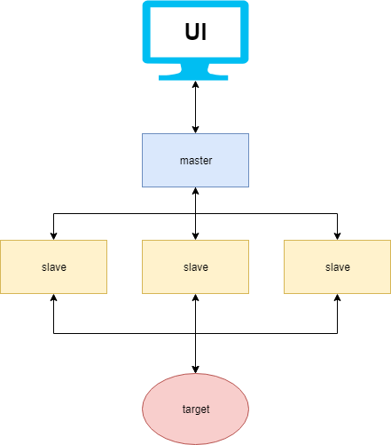

Một bước mà chúng ta thường xuyên bỏ qua và coi thường khi xây dựng một service mới đó là load test nó. Load test là một quá trình quan trọng trước khi đưa sản phẩm vào thực tế. Load test mang lại rất nhiều lợi ích: cho ta biết khả năng phục vụ bao nhiêu người dùng cùng lúc của service, chất lượng dịch vụ trong các tình trạng tải khác nhau, phát hiện được những `bug` chỉ xảy ra trong môi trường multi-threading, ...

# Giới thiệu

Load test là một dạng của [performance testing](https://www.guru99.com/performance-testing.html). Chúng ta sẽ xác định được hiệu năng của hệ thống trong các điều kiện tải khác nhau trong thực tế. Bài kiểm tra này giúp ta hiểu hơn về hành vi của hệ thống khi có nhiều người dùng truy cập đồng thời.

Các bài load testing thường dùng để:

- Đo lượng request tối đa mà ứng dụng có thể phục vụ.
- Số lượng người dùng có thể phục vụ đồng thời và khả năng mở rộng khi có nhiều người dùng hơn truy cập.
- Nhận dạng những vị trí `bottleneck` trước khi lên production.
- Giảm rủi ro khi hệ thống downtime.
- Hiểu về hệ thống trong các điều kiện tải khác nhau: đánh giá hiệu năng database, thời gian các transaction, vấn đề thiết kế, giới hạn phần cứng,... để tạo ra những quyết định tinh chỉnh phù hợp.

Load testing còn nhiều lợi ích tích cực khác, nếu bạn vẫn chưa quen với khái niệm load testing có thể tìm hiểu thêm ở [Load Testing Tutorial](https://www.guru99.com/load-testing-tutorial.html).

Để thực hiện một bài load testing, ta có thể chọn nhiều công cụ khác nhau như Gatling, JMeter, The Grinder,... Nhưng trong bài viết này, mình sẽ sử dụng một công cụ khá nổi tiếng khác đó là Locust. Tại sao Locust được xem là tốt hơn, mình sẽ cho bạn thấy lợi thế của Locust so với Jmeter ( Đây là tool khá nổi tiếng về load testing). Đầu tiên, GUI của Jmeter khá tốt nhưng không phải nghiệp vụ nào cũng có thể `point-and-click` là được. Thứ hai, Jmeter là `thread-bound`, nghĩa là mỗi user bạn tạo ra trong quá trình test là một thread, hay nói cách khác, khi ta giả lập hàng ngàn người dùng cùng lúc trên một máy thì nó không thực hiện tốt được.

Locust là một công cụ load testing mà có thể tính toán được có bao nhiêu user đồng thời mà hệ thống có thể xử lý được. Locust cung cấp một Web-based UI, khả năng `load test distributed` trên nhiều máy và có thể tạo ngữ cảnh test với Python, Golang hoặc Java. Mình đã thử qua các thư viện kết nối với Locust và thấy [Boomer](https://github.com/myzhan/boomer) là tốt nhất vì các ưu điểm sau:

- Tạo load test nhưng ít tốn tài nguyên và tối ưu hóa resource nhờ được biết bằng Golang.
- Viết các testcase khá nhanh và dễ.
- Hỗ trợ rate limit.
- Có thể custom output.

# Chế độ phân tán của Locust

Khi mà một máy đơn không thể tạo đủ số lượng người dùng mà bạn cần, thì lúc này cơ chế phân tán sẽ giúp ta chạy load test trên nhiều máy khác nhau. Locust sẽ hoạt động gồm 2 thành phần: master và slave.

- Master: Khi ta khởi chạy một instance Locust dưới chế độ master thì nó sẽ cung cấp một giao diện web để xem các giá trị thống kê, nó cũng sẽ không giả lập bất kì người dùng nào để load test mà chỉ đảm bảo nhiệm vụ cung cấp UI.
- Slave: Có thể được viết bằng nhiều ngôn ngữ Python, Java hoặc Golang. Slave sẽ hoạt động độc lập nhau, nhận lệnh điều khiển từ Locust master. Slave sẽ giả lập người dùng và gửi yêu cầu cho service, sau đó nó ghi nhận thông tin như latency rồi trả cho master.



# Boomer

Trong phần này chúng ta sẽ đi sâu vào cơ chế hoạt động master slave của Locust thông qua thư viện boomer. Thư viện boomer cung cấp khả năng giả lập số người dùng gửi yêu cầu vào hệ thống. Nhờ vào việc sử dụng goroutine nên boomer mang lại hiệu năng vượt trội so với các ngôn ngữ khác. Có một lưu ý là hãy sử dụng boomer như thư viện chứ không phải một công cụ benchmark.

Để dễ hiểu hơn về cách sử dụng boomer. Mình sẽ tạo ra một ví dụ đơn giản như sau: mình sẽ load test một `ping pong service` bằng locust và boomer (Source code có thể tham khảo ở [example_locust_boomer](https://github.com/thinhdanggroup/example_locust_boomer)). Mô hình triển khai và hoạt động như hình bên dưới:


Khi ta thực hiện việc tạo một bài test mới trên Locust UI thì chuyện gì sẻ xảy ra?

- Người dùng sẽ tạo ra một bài kiểm tra gồm lượng người dùng cần mô phỏng (Number of users to simulate) và số lượng request mỗi giây (Hatch rate).
- Hai thông số cấu hình bài test trên sẽ được gửi đến từng slave của locust. Với boomer, mỗi người cần mô phỏng là một goroutine. Số lượng người dùng cần tạo ra để mô phỏng sẽ được chia đều cho số slave, ví dụ bạn có 4 slave và cần tạo 10000 người dùng thì mỗi slave sẽ tọa 2500 người dùng để bắn request.
- Sao khi mỗi goroutine được khởi tạo, nó sẽ thực hiện một `Task` được định nghĩa sẵn từ trước. `Task` sẽ thực hiện một business logic của bạn. Như ví dụ ở đây, Task sẽ là thực hiện một request gọi vào API ping. Ngoài ra, Boomer hỗ trợ việc đặt trọng số cho từng task, tính năng này khá hữu hiệu khi bạn cần test nhiều API cùng lúc.
- Ở mỗi `Task`, ta cần ghi nhận trạng thái của request là thành công hay thất bại và các meta data cho nó. Như ví dụ dưới đây là mình đã tính latency cho việc request vào API /ping sau đó ghi nhận kết quả về Locust thông qua hàm `RecordSuccess`. Trong trường hợp lỗi xảy ra, chúng ta cũng cần ghi nhận các kết quả để hỗ trợ thống kê qua `RecordFailure`.
- Ở trên giao diện của Locust, ta sẽ thấy được các thông số cần thiết như về latency như giá trị trung bình, min, max, p95. Ngoài ra, các bạn có thể thêm nhiều metric khác như p99 ở phần thống kê.

Đi sâu một tí về cách hiện thực, ở đây mình dùng ví dụ có sẵn ở trang chủ [client.go](https://github.com/myzhan/boomer/blob/master/examples/http/client.go). Ta sẽ gửi thông tin về cho master thông qua 2 hàm:

- `RecordFailure`: ghi nhận các giá trị lỗi.
- `RecordSuccess`: ghi nhận các giá trị thành công. Lưu ý: locust chỉ tính throughput và latency cho các record success.

```go
func worker() {
	request, err := http.NewRequest(method, url, bytes.NewBuffer(postBody))
	if err != nil {
		log.Fatalf("%v\n", err)
	}

	request.Header.Set("Content-Type", contentType)

	startTime := time.Now()
	response, err := client.Do(request)
	elapsed := time.Since(startTime)

	if err != nil {
		if verbose {
			log.Printf("%v\n", err)
		}
		boomer.RecordFailure("http", "error", 0.0, err.Error())
	} else {
		boomer.RecordSuccess("http", strconv.Itoa(response.StatusCode),
			elapsed.Nanoseconds()/int64(time.Millisecond), response.ContentLength)

		if verbose {
			body, err := ioutil.ReadAll(response.Body)
			if err != nil {
				log.Printf("%v\n", err)
			} else {
				log.Printf("Status Code: %d\n", response.StatusCode)
				log.Println(string(body))
			}

		} else {
			io.Copy(ioutil.Discard, response.Body)
		}

		response.Body.Close()
	}
}
```

# Load testing với rate limit

Tại sao load test lại cân `rate limit`?

- Hãy nhớ lại khái niệm load test, ta cần phải hiểu rõ hệ thống trong những điều kiện tải khác nhau. Thông thường, ta sử dụng rate limit để đo được trạng thái giá trị latency và throughput của hệ thống trong điều kiện tải bình thường, với mục đích là tạo ra một cam kết SLA chính xác.
- Cùng với việc sử dụng rate limit, ta có thể tìm ra được giá trị tối đa của throughput mà việc load test bình thường không thể hiện được. Khi có rate limit, tỉ lệ xung đột tải nguyên sẽ giảm, ở một mức độ nào đó, ta sẽ tìm được lượng tải tối đa mà hệ thống hoạt động ở mức hiệu quả nhất. Từ đó, ta có thể giới hạn lượng request để hệ thống không hoạt động quá tải và phí tài nguyên cho `context switch`.
- Giả sử, bạn nói rằng service của bạn có thể xử lý đồng thời 100000 req/s. Nhưng nó vẫn chưa đủ, bạn vẫn chưa nói về latency khi có 100000 req/s. Nếu p99 lúc đó là 60 giây thì thật không thể chấp nhận được. Vì vậy, khi một cam kết nào đó ta luôn phải ưu tiên latency hay cụ thể là p99 ở ngưỡng nào đó với throughtput là bao nhiêu. Ví dụ: service của tôi có khả năng xử lý 10000 req/s với p99 < 10ms.
- Từ lý do đó, ta phải sử dụng `rate limit` để tìm ra throughput phù hợp với p99 mà ta mong đợi.

Lưu ý về cách đặt giá trị rate limit:

- Chúng ta thường chọn tham số rate limit với đơn vị là `req/s`. Đây có thể là một sai lầm lớn khi load test một service mà sử dụng rate limit. Nó sẽ không có vấn đề gì nếu số lượng request được phân bố trong một giây. Nhưng với boomer, nếu bạn chọn sai cấu hình rate limit thì bài test sẽ không đánh giá đúng chất lượng của service. Tại sao mình lại đưa ra nhận định này? Cùng tìm hiểu cách boomer hiện thực rate limiter.
- Khi hết một chu kì, boomer sẽ làm đầy số request còn được phép bắn vào service. Ví dụ: ta cấu hình số rate limit là 100 req/s thì cứ mỗi 1s sẽ có tối đa 100 request được phép bắn tới service. Và boomer sẽ cố gắng bắn số request này nhanh nhất có thể, dẫn đến hiện tượng toàn bộ request tập trung ở phần đầu chu kì, còn phần sau thì không có request nào được bắn nữa. Lúc này, hiện tượng nút thắc cỗ chai diễn ra, và ta sẽ đánh giá sai năng lực của service. Vì vậy, hãy lun cân nhất chọn cấu hình với chu kì nhỏ để phù hợp hơn, 100req/s thành 1req/10ms.

Vậy làm sao sử dụng được rate limit trong boomer? Bommer hỗ trợ hai cơ chế rate limit như sau:

- Standard ratelimiter: số lượng request bắn đi sẽ được cấu hình đúng với mức tối đa. Điều này có thể tạo ra hiện tượng tăng vọt về latency lúc mới bắt đầu test và nó sẽ ổn định về sau khi. Nhưng những kết quả lúc ban đầu này làm ảnh hưởng tới các kết quả trung bình hay p99 nếu bài test của bạn quá ngắn.
- Rampup rate limiter: số lượng request sẽ tăng đều cho đến khi đạt giá trị giới hạn. Nó giúp service có thời gian `warn-up`, giúp ta có những số liệu thống kê chính xác hơn.


Cách thiết lập rate limit cực kì đơn giản khi trang chủ đã có ngay [hai ví dụ](https://github.com/myzhan/boomer/tree/master/examples/ratelimit) về hai rate limiter này.

# Tổng kết

Nhờ các công cụ như locust và boomer thì việc load testing nay đã dễ dàng hơn rất nhiều. Từ việc tạo ra các ngữ cảnh test, vận hành các công cụ test đến các số liệu thống kê và hiển thị, chúng ta có thể có tất cả chúng một cách dễ dàng. Vậy còn chờ gì nữa mà không tạo ra một bài test cho chính service của bạn ngay bây giờ. 
