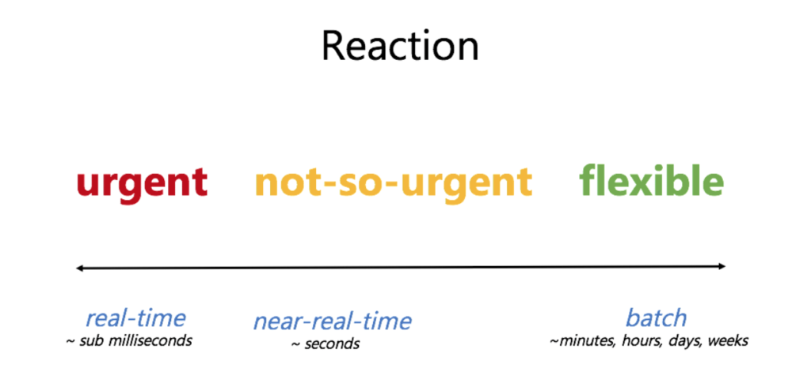

---
author:
  name             : "Thinh Dang"
  avatar           : "/assets/images/avatar.png"
  bio              : "Experienced Fintech Software Engineer Driving High-Performance Solutions"
  location         : "Viet Nam"
  email            : "thinhdang206@gmail.com"
  links:
    - label: "Linkedin"
      icon: "fab fa-fw fa-linkedin"
      url: "https://www.linkedin.com/in/thinh-dang/"
toc: true
toc_sticky: true
header:
  overlay_image: /assets/images/streaming/banner-part1.jpeg
  overlay_filter: 0.5 
  teaser: /assets/images/streaming/banner-part1.jpeg
title:  "Nhật ký làm quen với Streaming Data"
tags: 
- streaming
- kafka
- avro
- spark
---

Chào mọi người, không biết mọi người đã trải qua tính cảnh như mình chưa. Trước đây, mình là `Software Engineer` tại một công ty fintech và chuyên xây dựng hệ thống real-time với latency vài ms (hệ thống accounting). Và rồi một ngày, sếp mình đưa mình một project xây dựng hệ thống report `near real-time` (hệ thống report cho accounting). Mình kiểu "what the f**k" nhưng rồi vẫn nhận vì mình nghĩ sẽ học thêm được rất nhiều vì đây là hệ thống cần techstack hoàn toàn mới (thế giới của big data) so với những thứ mình đã biết trước đây. Và rồi, một thế giới mới đến thật, một hệ thống offline report khác hoàn toàn với hệ thống online transaction từ logic tính toán, cách monitoring, logging, công nghệ và cả mindset. Thời gian đầu nó gần như làm mình ngụp lặn với những kiến thức và vấn đề. Nếu các bạn cũng gặp tình huống như mình, lời khuyên chân thành hãy bắt đầu với quyền [Designing Data-Intensive Applications](https://www.amazon.com/Designing-Data-Intensive-Applications-Reliable-Maintainable/dp/1449373321), vì chưa có người hướng dẫn nên trước đây mình đã vấp ngã rất nhiều nhưng quyển sách này quả thật đã đưa mình tới chân trời mới. Giờ cùng mình làm quen với streaming data nhé.

## Stream Processing với Batch processing

Đây là kiến thức đầu tiên mình thấy cơ bản và giá trị nhất. Chúng không có một định nghĩa chính thống nhưng có thể hiểu đơn giản như sau: 

- Với batch processing: 
  - Một tập dữ liệu được thu thập qua thời gian, sau đó đưa vào hệ thống phân tích. Hay nói cách khác, bạn thu thập toàn bộ dữ liệu và đem đi xử lý.
  - Phù hợp với những hệ thống có report không cần real-time như Payroll, Billing, ...
  - Ưu điểm: đơn giản, dễ hiện thực, dễ xử lý khi có sự cố, phù hợp với các hệ thống truyền thống chưa hỗ trợ stream.
  - Nhược điểm: khi lượng dữ liệu lớn thì thời gian xử lý cũng lâu hơn, khả năng scale không tốt
- Với stream processing: 
  - Dữ liệu được đưa vào hệ thống phân tích từng phần nhỏ, và lượng dữ liệu này là vô hạn, không bao giờ dừng lại.
  - Phù hợp với những hệ thống cần report realtime như fraud detection, log monitoring, ...
  - Ưu điểm: report real-time, khả năng scale tốt khi data càng ngày càng lớn.
  - Nhược điểm:
    - Xây dựng phức tạp, phải đảm bảo yếu tố idempotent, cần checkpoint, ...
    - Monitoring phức tạp
    - Khắc phục sự cố khó hơn nhiều so với batch processing

Thời gian đâu, mình đã nghĩ đơn giản, streaming khá giống như cách ta xử lý request-response của hệ thống realtime, mỗi event tới thì mình sẽ xử lý như 1 request, và lưu id event lại để mình không xử lý hai lần cũng như kiểm tra missing dễ hơn. Thế là mình bắt tay xây dựng một hệ thống bằng java. Nhưng hệ thống hoàn toàn thất bại về performance khi một hệ thống offline phải chiụ tải và xử lý như hệ thống online. Hệ thống offline luôn luôn nên xử lý data dạng batch, nó giảm đi rất nhiều IO và sử dụng tối ưu hoá resource hệ thống.

Những nâng cấp bắt đầu, mình chuyển sang xử lý từng batch nhỏ với việc scan database theo một window time và lưu lại checkpoint sau khi xử lý xong, performance quả thực tăng một cách tích cực. Mọi thứ hoàn toàn trông khá tuyệt. Nhưng đời không như mơ, những late event đến, chúng nằm ngoài khoảng thời gian window của mình, giải pháp truy vấn bằng thời gian của hệ thống khác làm window time là sai lầm lớn nhất. Chúng ta nên phải tránh việc này, nếu không muốn phải hối hận cho sao này. Điều này dẫn tới khái niệm watermark, các kỹ thuật làm việc với window sẽ được nói ở series sau.

## Đau để trưởng thành

Qua những bài học trên, mình nhận ra nên bắt đầu mọi thứ chuẩn chỉ hơn bằng cách:

- Hiểu rõ data mình đang làm việc bằng batch processing, làm rõ hết các business flow (`make the right thing first`) rồi hãy ứng dụng stream processing.
- Sử dụng các technical stack của big data: Spring Batch, CDC, spark, kafka, spark streaming, kafka streaming.

Để dễ dàng hiểu rõ các công nghệ trên, mình sẽ sử dụng một ví dụ cực kì thú vị đó là tính báo của [Bảng cân đối thử](https://vietnambiz.vn/bang-can-doi-thu-trial-balance-la-gi-yeu-cau-doi-voi-bang-can-doi-thu-20200406180315126.htm) dựa trên lịch sử giao dịch của người dùng.

Trong lĩnh vực accounting, chúng ta sẽ dùng debit hoặc credit để thể hiện ý nghĩa của bút toán. Mình sẽ xem bút toán debit là giảm tiền user và credit là tăng tiền. Báo cáo bảng cân đối thử này sẽ tính theo kỳ là 1 ngày. Một điều quan trọng của báo cáo cân đối đó là số dư đầu kỳ (open) và cuối kỳ (close). Số close của kỳ T sẽ là open của kỳ T+1.

Công thức tính close sẽ như sau:
close = open - debit + credit

Dữ liệu log sẽ có dữ liệu mẫu như sau:

|user|time (time in microseconds)|amount|debit|
|-|-|-|-|
|u1|1622480400000|1000|true|
|u1|1622480400000|2000|false|
|u2|1622480400000|1000|false|
|u1|1622566800000|3000|true|

Ý nghĩa record 1 thì u1 thực hiện giao dịch vào lúc 1622480400000 (ngày 01/06/2021) với debit 1000đ.

Kết quả mong đợi của Bảng cân đói thử sẽ như sau:

|user|date|open|debit|credit|close|
|-|-|-|-|-|-|
|u1|20210601|0|1000|2000|1000|
|u2|20210601|0|0|1000|1000|
|u1|20210602|1000|3000|0|-2000|

Với user u1, ta thấy cuối kỳ ngày 01/06/2021 là 1000 nên số đầu kỳ của ngày 02/06/2021 là 1000. Vào ngày 2/6/2021, có giao dịch phát sinh debit 3000, sau khi áp dụng công thức tính close thì ta được số cuối kỳ là -2000. Cũng dễ hiểu phải không nào.

Mình muốn sử dụng ví dụ này vì nó sẽ phải sử dụng khá nhiều thứ như transform, group, sum, map, ... Mình hi vọng qua ví dụ này thì mọi người sẽ hiểu rõ các công nghệ trên.

Đoán chờ part 2 của series này nhé, chúng ta sẽ bắt đầu với Spring Batch.
