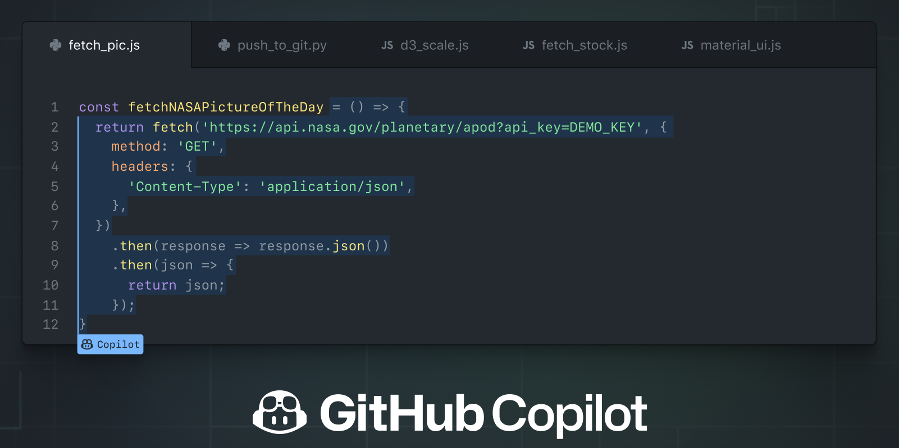

---
author:
  name             : "Thinh Dang"
  avatar           : "/assets/images/avatar.png"
  bio              : "Experienced Fintech Software Engineer Driving High-Performance Solutions"
  location         : "Viet Nam"
  email            : "thinhdang206@gmail.com"
  links:
    - label: "Linkedin"
      icon: "fab fa-fw fa-linkedin"
      url: "https://www.linkedin.com/in/thinh-dang/"
toc: true
toc_sticky: true
header:
  overlay_image: /assets/images/copilot/copilot.jpeg
  overlay_filter: 0.5 
  teaser: /assets/images/copilot/copilot.jpeg
title:  "GitHub Copilot: A Review and Guide for Beginners"
tags: 
- github copilot
---

Have you ever wished you had a smart and helpful partner who could assist you with coding? Someone who could suggest code snippets, functions, or solutions based on the context of your code? Someone who could help you learn new skills, perspectives, and approaches from the code they suggest? Someone who could make coding faster and easier for you?

If you answered yes to any of these questions, then you might be interested in GitHub Copilot, an AI pair programmer that can do all of these things and more. In this blog post, I will share with you my experience of using GitHub Copilot for the past few months, and give you some tips and tricks on how to use it effectively.

## What is GitHub Copilot?

GitHub Copilot provides code suggestions from an AI system as you type. It uses OpenAI Codex, a machine learning model that translates natural language into code, to generate relevant suggestions based on the context and intent of your code. It can suggest whole lines or entire functions for various languages and frameworks, such as Python, JavaScript, TypeScript, Ruby, and Go.

GitHub Copilot is not a magic tool that can write code for you. It is not perfect, and it cannot guarantee the correctness, quality, or security of the code it suggests. You still need to review and edit the suggestions before accepting them, and test them for functionality and performance. You also need to check the source and license of the suggestions, especially if you are working on a commercial or open source project.

GitHub Copilot is a powerful tool that can help you write code faster and with less work. It can also help you learn new skills, perspectives, and approaches from the code it suggests. You can use GitHub Copilot to explore different solutions, discover new libraries or frameworks, or get inspired by different coding styles or techniques. You can also ask GitHub Copilot questions or challenges in your comments, and see how it responds.

### How to get started with GitHub Copilot?

Before you can start using GitHub Copilot, you will need to install the extension in Visual Studio Code. You can find it in the Visual Studio Code Marketplace or by searching for it in the Extensions tab within Visual Studio Code.

You will also need to sign in to GitHub Copilot with your GitHub account. You will need a GitHub Copilot subscription or a free trial to use it. You can sign up for GitHub Copilot on the GitHub website or in the Visual Studio Code settings.

GitHub Copilot is free to use for verified students, teachers, and maintainers of popular open source projects. If you are not a student, teacher, or maintainer of a popular open source project, you can try GitHub Copilot for free with a one-time 30-day trial. After the free trial, you will need a paid subscription for continued use. For more information on pricing and billing for GitHub Copilot, [see this page](https://github.com/features/copilot#pricing).

Once you have installed the extension and signed in to GitHub Copilot with your subscription or trial, you can start coding in a file as usual. You can use any language or framework that GitHub Copilot supports. As you type, you will see a suggestion box with a blue border and a Copilot icon at the bottom right corner.

To activate GitHub Copilot's suggestions, press `Ctrl+Shift+Space` or `Cmd+Shift+Space` (on Mac). To review the suggestion and accept it by pressing Tab or Enter, or reject it by pressing Esc. You can also cycle through different suggestions by pressing `Ctrl+.` or `Cmd+.` (on Mac).

To edit the suggestion as needed. You can also add comments or docstrings to provide more context for GitHub Copilot to generate better suggestions.

## How to use GitHub Copilot effectively?

GitHub Copilot is a powerful tool that can help you write code faster and with less work. But like any tool, you need to know how to use it well. Here are some tips on how to use GitHub Copilot effectively:

- Write clear and descriptive comments. GitHub Copilot uses your comments to understand the context and intent of your code, and to generate relevant suggestions. The more specific and informative your comments are, the better GitHub Copilot can help you.
- Review and edit the suggestions. GitHub Copilot is not perfect, and it cannot guarantee the correctness, quality, or security of the code it suggests. You should always review and edit the suggestions before accepting them, and test them for functionality and performance. You should also check the source and license of the suggestions, especially if you are working on a commercial or open source project.
- Use GitHub Copilot as a learning tool. GitHub Copilot can help you learn new skills, perspectives, and approaches from the code it suggests. You can use GitHub Copilot to explore different solutions, discover new libraries or frameworks, or get inspired by different coding styles or techniques. You can also ask GitHub Copilot questions or challenges in your comments, and see how it responds.
- Experiment with different settings and preferences. GitHub Copilot has various settings and preferences that you can customize to suit your needs and preferences. You can change the frequency, length, and style of the suggestions, as well as the keyboard shortcuts and commands to activate them. You can also enable or disable certain features, such as multi-line suggestions, docstring suggestions, or code translation suggestions. You can find these settings in the Visual Studio Code settings or in your GitHub Copilot settings page.
- Provide feedback and report issues. GitHub Copilot is still a new and evolving product, and it relies on your feedback and input to improve. You can provide feedback or report issues by clicking on the smiley face icon at the bottom right corner of the suggestion box, or by using the command palette in Visual Studio Code. You can also join the GitHub Copilot community forum to share your experiences, ideas, or questions with other users.

## My experience of using GitHub Copilot

I have been using GitHub Copilot for the past few months, and I must say that I am impressed by its capabilities and potential. I have used it for various projects and tasks, such as writing blog posts (like this one), creating web applications, building data pipelines, and solving coding challenges.

GitHub Copilot has helped me write code faster and with less work. It has saved me time and effort by suggesting code snippets, functions, or solutions that I would otherwise have to write myself or look up online. It has also helped me avoid typos, errors, and bugs by catching them before they cause problems.

GitHub Copilot has also helped me learn new skills, perspectives, and approaches from the code it suggests. It has exposed me to different coding styles, techniques, and best practices that I can adopt and apply in my own projects. It has also introduced me to new libraries or frameworks that I can use to enhance my code. It has also challenged me to think of different ways to solve problems by asking me questions or giving me alternatives.

GitHub Copilot is not perfect, and it has some limitations and challenges. Sometimes it suggests code that is incorrect, irrelevant, or insecure. Sometimes it does not understand my comments or intent. Sometimes it does not support the language or framework that I want to use. Sometimes it does not give me any suggestions at all.

But these are minor issues compared to the benefits that GitHub Copilot provides. I always review and edit the suggestions before accepting them, and test them for functionality and performance. I also check the source and license of the suggestions, especially if I am working on a commercial or open source project. I also provide feedback and report issues to help GitHub Copilot improve.

## Conclusion

GitHub Copilot is an AI pair programmer that can help you write code faster and with less work. It can also help you learn new skills, perspectives, and approaches from the code it suggests. You can use GitHub Copilot by installing the extension in Visual Studio Code, signing in with your GitHub account, and activating its suggestions as you type.

GitHub Copilot is not perfect, and it cannot guarantee the correctness, quality, or security of the code it suggests. You still need to review and edit the suggestions before accepting them, and test them for functionality and performance. You also need to check the source and license of the suggestions, especially if you are working on a commercial or open source project.

GitHub Copilot is a powerful tool that can help you write code faster and with less work. But like any tool, you need to know how to use it well. I hope that this blog post has given you some tips and tricks on how to use GitHub Copilot effectively.

If you are interested in trying GitHub Copilot for yourself, you can sign up for a free trial or subscription on the GitHub website. You can also join the GitHub Copilot community forum to share your experiences, ideas, or questions with other users.

Thank you for reading this blog post. I hope you enjoyed it and learned something from it. If you did, please share it with your friends and colleagues who might be interested in GitHub Copilot. You can also leave a comment below to let me know what you think of GitHub Copilot, or if you have any questions or feedback for me.