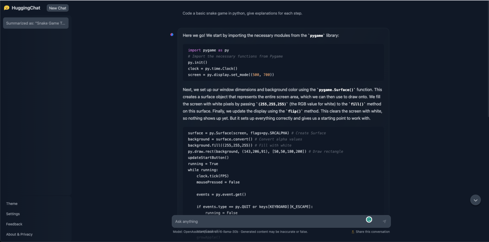
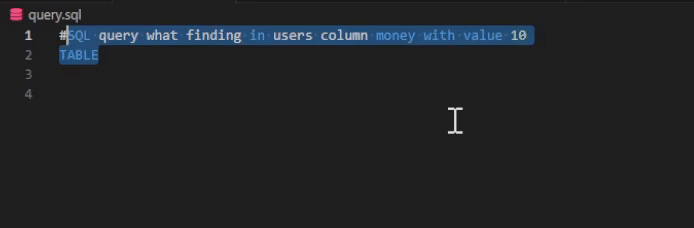

Bạn có muốn viết code chỉ bằng cách nói ra ý tưởng của mình? Bạn có muốn có một người bạn đồng hành trong lập trình, luôn sẵn sàng giúp đỡ và tư vấn cho bạn? Bạn có muốn tận hưởng công nghệ AI tiên tiến nhất trong lĩnh vực code mà không tốn một xu nào? Nếu bạn gật đầu đồng ý, thì hãy cùng tôi khám phá Starcoder, một công cụ hỗ trợ lập trình đột phá.

Trong bài viết này, bạn sẽ biết được:

- Starcoder là gì và nó được tạo ra như thế nào?
- Starcoder có thể làm gì và làm thế nào để sử dụng nó?
- Những lợi ích và thách thức khi sử dụng Starcoder cho các dự án lập trình của bạn.
- Những kinh nghiệm và lời khuyên của tôi khi sử dụng Starcoder.

Hãy cùng bắt đầu nhé!

## Starcoder là gì?

Starcoder là một **mô hình ngôn ngữ lớn cho lập trình** (Large Language Model for Programming - LLM) được huấn luyện trên mã nguồn và văn bản tự nhiên. Nó có thể thực hiện các nhiệm vụ như sinh code, hoàn thiện code, chỉnh sửa code và giải thích code. Nó cũng có một **độ dài ngữ cảnh hơn 8.000 token**, cho phép nó xử lý nhiều đầu vào hơn bất kỳ LLM nào khác. Bạn có thể tìm hiểu thêm chi tiết về Starcoder trên GitHub hoặc trên bài đăng blog của Hugging Face. Bạn cũng có thể thử Starcoder như một **trợ lý kỹ thuật** hoặc như một **tiện ích mở rộng VS Code**.

Starcoder được phát triển bởi Hugging Face và ServiceNow trong khuôn khổ của dự án BigCode, một sáng kiến nhằm phát triển các hệ thống AI tiên tiến cho code một cách công khai và có trách nhiệm với sự hỗ trợ của cộng đồng nghiên cứu AI khoa học. Starcoder được phát hành theo giấy phép OpenRAIL-M, một giấy phép mới được cải tiến để đặt ra các hạn chế pháp lý về việc sử dụng và chỉnh sửa mô hình.

## Starcoder có thể làm gì?

Starcoder có thể làm rất nhiều điều tuyệt vời với code. Dưới đây là một số ví dụ:

### Sinh code

Starcoder có thể sinh code từ các mô tả bằng ngôn ngữ tự nhiên. Ví dụ, bạn có thể yêu cầu Starcoder tạo một hàm tính tổng hai số trong Python như sau:

```python
def sum_two_numbers(a, b):
```

Starcoder sẽ sinh ra đoạn code hoàn chỉnh như sau:

```python
def sum_two_numbers(a, b):
    # return the sum of a and b
    return a + b
```

Bạn có thể thử sinh code với Starcoder tại đây.

### Hoàn thiện code

Starcoder cũng có thể hoàn thiện code khi bạn nhập vào một phần của code. Ví dụ, bạn có thể nhập vào đoạn code sau trong Java:

```python
public class HelloWorld {
    public static void main(String[] args) {
        System.out.print
```

Starcoder sẽ hoàn thiện đoạn code như sau:

```python
public class HelloWorld {
    public static void main(String[] args) {
        System.out.println("Hello, world!");
    }
}
```

Bạn có thể thử hoàn thiện code với Starcoder tại đây.

### Chỉnh sửa code

Starcoder không chỉ sinh và hoàn thiện code, mà còn có thể chỉnh sửa code theo các chỉ dẫn của bạn. Ví dụ, bạn có thể yêu cầu Starcoder thay đổi tên biến trong đoạn code sau trong C++:

```python
int x = 10;
int y = 20;
int z = x + y;
cout << z << endl;
```

Bạn có thể viết chỉ dẫn như sau:

```python
Rename x to num1 and y to num2
```

Starcoder sẽ chỉnh sửa đoạn code như sau:

```python
int num1 = 10;
int num2 = 20;
int z = num1 + num2;
cout << z << endl;
```

Bạn có thể thử chỉnh sửa code với Starcoder tại đây.

### Giải thích code

Starcoder không chỉ biết viết code, mà còn biết giải thích code bằng ngôn ngữ tự nhiên. Ví dụ, bạn có thể yêu cầu Starcoder giải thích đoạn code sau trong JavaScript:

```python
function factorial(n) {
    if (n == 0 || n == 1) {
        return 1;
    }
    return n * factorial(n - 1);
}
```

Starcoder sẽ giải thích đoạn code như sau:

```python
This function calculates the factorial of a given number n. The factorial of a number is the product of all positive integers less than or equal to that number. For example, the factorial of 5 is 5 * 4 * 3 * 2 * 1 = 120. The function uses recursion to calculate the factorial. Recursion is a technique where a function calls itself with a smaller or simpler input until it reaches a base case. The base case for this function is when n is 0 or 1, in which case it returns 1. Otherwise, it returns n multiplied by the factorial of n - 1.
```

Bạn có thể thử giải thích code với Starcoder tại đây.

## Cách sử dụng Starcoder


Để sử dụng Starcoder, bạn cần phải chấp nhận điều khoản sử dụng tại hf.co/bigcode/starcoder và đăng nhập với token Hugging Face hub của bạn. Sau đó, bạn có hai cách để sử dụng Starcoder: như một trợ lý kỹ thuật trong một ứng dụng chat hoặc như một tiện ích mở rộng VS Code.

### Sử dụng Starcoder như một trợ lý kỹ thuật

Bạn có thể sử dụng Starcoder như một trợ lý kỹ thuật bằng cách giao tiếp với nó qua giao diện chat tại [đây](https://huggingface.co/chat/). Bạn chỉ cần nhập vào câu hỏi hoặc yêu cầu của bạn bằng ngôn ngữ tự nhiên và Starcoder sẽ trả lời hoặc sinh ra đoạn code phù hợp. Bạn cũng có thể chọn ngôn ngữ lập trình mong muốn.

### Sử dụng Starcoder như một tiện ích mở rộng VS Code



Bạn cũng có thể sử dụng Starcoder như một tiện ích mở rộng VS Code để hỗ trợ lập trình trong trình soạn thảo code của bạn. Bạn cần cài đặt tiện ích mở rộng StarCoderEx từ cửa hàng VS Code tại [đây](https://marketplace.visualstudio.com/items?itemName=Lisoveliy.starcoderex). Sau khi cài đặt, bạn có thể sử dụng Starcoder bằng cách nhập vào mô tả bằng ngôn ngữ tự nhiên trong trình soạn thảo hoặc trong bảng lệnh. Starcoder sẽ sinh ra đoạn code phù hợp với ngôn ngữ lập trình của bạn. Bạn cũng có thể sử dụng các phím tắt để kích hoạt Starcoder nhanh chóng. Bạn có thể xem hướng dẫn chi tiết về cách sử dụng Starcoder như một tiện ích mở rộng VS Code tại đây.

Sử dụng Starcoder như một tiện ích mở rộng VS Code có nhiều lợi ích, chẳng hạn như:

- Tăng năng suất và hiệu quả lập trình bằng cách giảm thiểu thời gian và công sức để viết code
- Tăng chất lượng và độ chính xác của code bằng cách giảm thiểu lỗi và sai sót
- Tăng sự sáng tạo và học hỏi bằng cách khám phá các giải pháp và kỹ thuật mới
- Tăng sự hài lòng và niềm vui bằng cách làm cho lập trình trở nên dễ dàng và thú vị hơn

## Kinh nghiệm và lời khuyên khi sử dụng Starcoder

Tôi đã sử dụng Starcoder cho một số dự án lập trình của tôi và tôi rất ấn tượng với khả năng của nó. Tôi đã sinh ra nhiều đoạn code hữu ích và chất lượng cao với chỉ một vài câu mô tả. Tôi cũng đã học được nhiều điều mới từ các giải pháp và kỹ thuật mà Starcoder đề xuất. Tôi thấy rằng Starcoder là một công cụ tuyệt vời để hỗ trợ lập trình.

Tuy nhiên, tôi cũng nhận ra rằng Starcoder không phải là hoàn hảo và có một số thách thức và giới hạn khi sử dụng nó. Dưới đây là một số kinh nghiệm và lời khuyên của tôi khi sử dụng Starcoder:

- Hãy viết các mô tả bằng ngôn ngữ tự nhiên rõ ràng, cụ thể và đầy đủ. Điều này sẽ giúp Starcoder hiểu ý định của bạn và sinh ra code phù hợp hơn.
- Hãy kiểm tra kỹ code được sinh ra bởi Starcoder trước khi sử dụng. Đừng tin tưởng hoàn toàn vào code của Starcoder mà không kiểm tra tính đúng đắn, an toàn và hiệu suất của nó.
- Hãy góp phần cải thiện Starcoder bằng cách gửi phản hồi, báo cáo lỗi hoặc đóng góp mã nguồn cho dự án. Bạn có thể liên hệ với nhóm phát triển của Starcoder qua GitHub hoặc Hugging Face.

## Kết luận

Starcoder là một công cụ hỗ trợ lập trình đột phá, có khả năng sinh code từ các mô tả bằng ngôn ngữ tự nhiên. Bạn có thể sử dụng Starcoder như một trợ lý kỹ thuật trong một ứng dụng chat hoặc như một tiện ích mở rộng VS Code. Sử dụng Starcoder có thể giúp bạn viết code nhanh hơn, chất lượng hơn, sáng tạo hơn và vui vẻ hơn. Tuy nhiên, bạn cũng cần chú ý đến các thách thức và giới hạn của Starcoder, và có một tư duy phản biện, một thái độ cởi mở và một trách nhiệm xã hội khi sử dụng nó.

Tôi hy vọng rằng bài viết này đã cung cấp cho bạn những thông tin hữu ích về Starcoder và khích lệ bạn thử nghiệm nó. Nếu bạn có bất kỳ câu hỏi hoặc ý kiến gì, xin vui lòng để lại bình luận bên dưới. Cảm ơn bạn đã đọc!

## Tài liệu tham khảo

- [GitHub - bigcode-project/starcoder](https://github.com/bigcode-project/starcoder)
- [Project Starcoder](https://starcoder.org/)
- [New VS Code Tool: StarCoderEx (AI Code Generator)](https://visualstudiomagazine.com/articles/2023/05/08/starcoder.aspx)
- [Hugging Face Releases StarCoder, the Next-Generation LLM](https://www.infoq.com/news/2023/05/hugging-face-starcoder/)