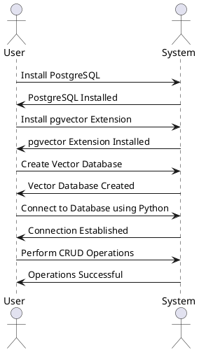

---
author:
  name             : "Thinh Dang"
  avatar           : "/assets/images/avatar.png"
  bio              : "Experienced Fintech Software Engineer Driving High-Performance Solutions"
  location         : "Viet Nam"
  email            : "thinhdang206@gmail.com"
  links:
    - label: "Linkedin"
      icon: "fab fa-fw fa-linkedin"
      url: "https://www.linkedin.com/in/thinh-dang/"
toc: true
toc_sticky: true
header:
  overlay_image: /assets/images/postgresql-vectordb/banner.jpeg
  overlay_filter: 0.5 
  teaser: /assets/images/postgresql-vectordb/banner.jpeg
title:  "Harnessing PostgreSQL as a Vector Database with Python"
---

Get ready to dive into the exciting world of vector databases! In this blog post, I'll show you how PostgreSQL can be used as a powerful vector database with the help of Python. I'll break down the concept of a vector database and explain how it can be used to your advantage in a variety of scenarios.

But that's not all - I'll guide you through the process of setting up PostgreSQL as a vector database using the pgvector extension. I'll even show you how to create indexes for lightning-fast data retrieval.

And the fun doesn't stop there! I'll also explore how to connect to your PostgreSQL vector database using Python and perform all sorts of operations. I'll share some insider tips on optimizing performance, scaling, backup and recovery, and maintaining the health of your PostgreSQL vector database.

But wait, there's more! I'll even give you a real-world example of using PostgreSQL as a vector database with Python. You'll learn how to generate embeddings, store them, and query them like a pro.

So what are you waiting for? Join us on this exciting journey and discover the power of PostgreSQL as a vector database with Python!

## Introduction

In the era of big data and machine learning, the ability to efficiently store, search, and analyze high-dimensional data is a critical requirement. One of the effective ways to manage this type of data is by using a vector database. A vector database is a type of database that stores data as high-dimensional vectors, which are mathematical representations of features or attributes. These vectors are usually generated by applying some kind of transformation or embedding function to the raw data, such as text, images, audio, video, and others[^1^].

One of the popular databases that can be extended to function as a vector database is PostgreSQL. PostgreSQL is a powerful, open-source object-relational database system that uses and extends the SQL language combined with many features that safely store and scale the most complicated data workloads[^2^].

With the help of an extension called pgvector, PostgreSQL can handle vector data efficiently. Pgvector is an open-source extension for PostgreSQL that enables storing and searching over machine learning-generated embeddings. It provides different capabilities that let users identify both exact and approximate nearest neighbors. It is designed to work seamlessly with other PostgreSQL features, including indexing and querying.

In this blog post, we will guide you on how to use PostgreSQL as a vector database and how to interact with it using Python. We will provide a step-by-step tutorial on setting up PostgreSQL as a vector database, creating and managing vector data, and performing operations like nearest neighbor search. We will also share some best practices and tips for using PostgreSQL as a vector database effectively.

## Understanding Vector Databases

A vector database is a specialized type of database designed to handle high-dimensional data efficiently. Unlike traditional relational databases that store data in structured tables, a vector database stores data as high-dimensional vectors. 

Vectors are mathematical representations of features or attributes, which can be derived from various types of raw data such as text, images, audio, video, and others. These vectors are usually generated by applying some kind of transformation or embedding function to the raw data. 

The primary advantage of vector databases lies in their ability to efficiently store and search vector data. They are particularly effective for tasks that require similarity search or nearest neighbor search. For instance, if you have a database of image vectors, you can quickly find images that are similar to a given image by comparing their vectors.

Vector databases are widely used in various applications, including:

1. **Machine Learning and Artificial Intelligence**: Vector databases are crucial in machine learning and AI applications, where high-dimensional data is common. They can store and manage feature vectors extracted from raw data for model training and prediction.

2. **Recommendation Systems**: In recommendation systems, vector databases can store user and item embeddings. These embeddings can be used to find similar users or items, enabling personalized recommendations.

3. **Information Retrieval**: Vector databases can store document embeddings in natural language processing applications. These embeddings can be used to find similar documents or to retrieve documents relevant to a particular query/

4. **Image and Video Processing**: In image and video processing applications, vector databases can store image or video embeddings. These embeddings can be used for tasks like image recognition, object detection, and video analysis.

In the next section, we will discuss how to set up PostgreSQL as a vector database using the pgvector extension.


## Setting Up PostgreSQL as a Vector Database with Docker

Setting up PostgreSQL as a vector database with Docker involves pulling the PostgreSQL and pgvector images from Docker Hub, running a PostgreSQL container with pgvector extension, and creating a vector database in PostgreSQL. The following steps will guide you through this process:

### 1. Pulling the PostgreSQL and pgvector Images from Docker Hub

Before you can create a vector database with Docker, you need to pull the PostgreSQL and pgvector images from Docker Hub. These images contain all the source code, dependencies, tools, and libraries that your PostgreSQL and pgvector applications need. Here are the general steps to do this:

1. Install Docker and Docker Compose on your system. You can follow the [official installation guide](https://www.baeldung.com/ops/postgresql-docker-setup) for your operating system.
2. Open your terminal or command prompt and run the following command to pull the latest stable version of the PostgreSQL image:

    docker pull postgres

3. Run the following command to pull the latest version of the pgvector image, which is an extension for PostgreSQL that enables it to handle vector data:

    docker pull ankane/pgvector

You can also pull a specific version of the PostgreSQL or pgvector image by appending a tag to the image name. For example, to pull the 14.2 version of the PostgreSQL image, you can run:

    docker pull postgres:14.2

For more detailed instructions, you can refer to the [PostgreSQL with Docker Setup](https://dev.to/shree_j/how-to-install-and-run-psql-using-docker-41j2) tutorial or the [How to Use the Postgres Docker Official Image](https://medium.com/@agusmahari/docker-how-to-install-postgresql-using-docker-compose-d646c793f216) blog post.

### 2. Running a PostgreSQL Container with pgvector Extension

After pulling the PostgreSQL and pgvector images from Docker Hub, you can run a PostgreSQL container with pgvector extension using Docker Compose. Docker Compose is a tool that allows you to define and run multiple containers using a YAML file. Here are the steps to do this:

1. Create a directory for your project and navigate to it in your terminal or command prompt.
2. Create a file named `docker-compose.yml` and paste the following content into it:
    ```yaml
    version: '3'
    services:
      db:
        image: ankane/pgvector
        environment:
          - POSTGRES_USER=test
          - POSTGRES_PASSWORD=test
        ports:
          - "5432:5432"
        volumes:
          - ./data:/var/lib/postgresql/data
    ```

    This file defines a service named `db` that uses the `ankane/pgvector` image as its base image. It also sets some environment variables for the PostgreSQL user name and password, maps the port 5432 of the container to the port 5432 of the host machine, and mounts the `./data` directory of the host machine to the `/var/lib/postgresql/data` directory of the container.

3. Run the following command to start the `db` service:

    docker-compose up -d

    This command will create and start a new container named `project_db_1` using the configuration defined in the `docker-compose.yml` file. The `-d` option will run the container in detached mode, meaning that it will run in the background.

4. To verify that the container is running, you can use the `docker ps` command. You should see something like this:

    CONTAINER ID   IMAGE             COMMAND                  CREATED         STATUS         PORTS                    NAMES
    7f7c9a8c4f8a   ankane/pgvector   "docker-entrypoint.s…"   5 minutes ago   Up 5 minutes   0.0.0.0:5432->5432/tcp   project_db_1

For more detailed instructions, you can refer to the Docker Compose documentation.

### 3. Creating a Vector Database in PostgreSQL

After running a PostgreSQL container with pgvector extension, you can create a vector database in PostgreSQL using a client tool or the psql command-line tool. Here are the steps to do this:

1. Connect to your PostgreSQL database using a client tool like pgAdmin or the psql command-line tool. You can also use the `docker exec` command to run psql inside the container. For example, you can run:

    ```shell
    docker exec -it project_db_1 psql -U test
    ```

    This command will execute psql inside the `project_db_1` container and connect to the PostgreSQL database as the `test` user. You will be prompted to enter your password that you set in step 2.

2. Run the `CREATE DATABASE your_database_name;` command to create a new database.
3. Connect to the newly created database.
4. Run the `CREATE EXTENSION pgvector;` command to enable the pgvector extension in the database.
5. Then, run the `CREATE TABLE your_table_name (id serial primary key, vector float4[]);` command to create a new table with a vector column. You can replace `your_table_name` with the name of your table, and `vector` with the name of your vector column.
6. Now, you can insert data into the vector column using the `INSERT` statement.

Remember that the pgvector extension supports various operations on the vector data, such as searching for nearest neighbors or calculating distances.

In the next section, we will discuss how to use Python to interact with the PostgreSQL vector database.

## Indexing in PostgreSQL Vector Database

Indexing is a critical aspect of a PostgreSQL vector database that significantly contributes to its performance and efficiency. Indexes are data structures that improve the speed of data retrieval operations on a database table. They function like pointers to the data that allow the database engine to access the data swiftly.

In the context of a vector database, indexing is particularly important for faster retrieval of similar embeddings. Without proper indexing, searching for similar vectors would involve scanning the entire database, which can be computationally expensive and time-consuming, especially for large databases.

### Importance of Indexing in a PostgreSQL Vector Database

Indexing in a PostgreSQL vector database has several benefits:

1. **Speed Up Search**: By creating indexes on the embedding vectors, you can speed up the process of searching for similar embeddings. This can reduce the latency and improve the user experience of your vector-based applications.
2. **Optimize Search Performance**: Building indexes in a vector database helps in optimizing the search performance. This can increase the throughput and scalability of your vector-based applications.
3. **Efficient Data Retrieval**: Indexes allow the database engine to locate and retrieve data without having to scan the entire database. This can save disk space and CPU resources, and avoid unnecessary I/O operations.
4. **Enhanced Query Performance**: Indexes can significantly enhance the performance of data retrieval queries. This can enable more complex and expressive queries on your vector data, such as filtering, aggregating, joining, etc.

### Creating Indexes in a PostgreSQL Vector Database

Creating indexes in a PostgreSQL vector database involves using specific functions provided by the pgvector extension. Pgvector supports the `ivfflat` index type, which is used for approximate nearest neighbor (ANN) searches. The index can be built after inserting the data into the database and should be tuned based on the number of lists to use.

Here is a simple example of how to create an index on a vector column in a PostgreSQL vector database:

```sql
CREATE INDEX your_index_name ON your_table_name USING ivfflat (vector);
```

In the above SQL statement, replace `your_index_name` with the name of your index, and `your_table_name` with the name of your table.

Remember, it is also important to specify the distance measure used for indexing, such as the Cosine distance. By default, pgvector performs exact nearest neighbor search, which provides perfect recall³. You can add an index to use approximate nearest neighbor search, which trades some recall for performance³. Unlike typical indexes, you will see different results for queries after adding an approximate index.

Proper indexing is a crucial aspect of using PostgreSQL as a vector database. It ensures efficient data retrieval and optimized search performance, making it a vital practice for managing and querying high-dimensional vector data.

In the next section, we will explore how to use Python to interact with a PostgreSQL vector database.


## Using Python with PostgreSQL Vector Database

Python is a versatile language that provides several libraries for interacting with databases, including PostgreSQL. For PostgreSQL, some of the popular libraries include `psycopg2`, `SQLAlchemy`, and `asyncpg`. These libraries provide APIs to interact with PostgreSQL and execute SQL queries. They can be used to establish connections, perform CRUD operations, and handle database transactions.

In this section, we will discuss how to connect to a PostgreSQL vector database using Python, perform CRUD operations, and handle errors and exceptions.



### Connecting Python to PostgreSQL Vector Database

To connect Python to a PostgreSQL vector database, you can use the `psycopg2` library[^6^][^7^][^8^]. Here is a simple example of how to establish a connection to a PostgreSQL database:

```python
import psycopg2

conn = psycopg2.connect(
    host='your_host',
    port='your_port',
    dbname='your_database',
    user='your_username',
    password='your_password'
)
```

In the above code, replace `'your_host'`, `'your_port'`, `'your_database'`, `'your_username'`, and `'your_password'` with your actual PostgreSQL database details.

### Performing CRUD Operations with Python on PostgreSQL Vector Database

Once you have established a connection with the PostgreSQL vector database, you can perform CRUD (Create, Read, Update, Delete) operations. Here's an example of how to perform each operation:

- **Create**: Use the `INSERT` statement to insert data into a table. For example:

```python
cur = conn.cursor()
cur.execute("INSERT INTO your_table_name (vector) VALUES (%s)", ([1.23, 4.56, 7.89], ))
conn.commit()
```

- **Read**: Use the `SELECT` statement to retrieve data from a table. For example:

```python
cur.execute("SELECT * FROM your_table_name")
rows = cur.fetchall()
for row in rows:
    print(row)
```

- **Update**: Use the `UPDATE` statement to update existing data in a table. For example:

```python
cur.execute("UPDATE your_table_name SET vector = %s WHERE id = %s", ([9.87, 6.54, 3.21], 1))
conn.commit()
```

- **Delete**: Use the `DELETE` statement to remove data from a table. For example:

```python
cur.execute("DELETE FROM your_table_name WHERE id = %s", (1, ))
conn.commit()
```

### Error Handling and Debugging in Python for PostgreSQL

When working with PostgreSQL in Python, it is important to follow these best practices for error handling and debugging:

1. **Use try-except blocks** to catch and handle exceptions that may occur during database operations.
2. **Use logging or other error handling mechanisms** to record and report errors for debugging purposes.
3. **Validate and sanitize user inputs** to prevent SQL injection attacks.
4. **Use parameterized queries or prepared statements** to avoid SQL syntax errors and improve performance.
5. **Enable query logging** and examine the logs for troubleshooting database issues.

For example, here's how you can handle exceptions during a database operation:

```python
try:
    cur.execute("INSERT INTO your_table_name (vector) VALUES (%s)", ([1.23, 4.56, 7.89], ))
    conn.commit()
except psycopg2.Error as e:
    print(f"An error occurred: {e}")
finally:
    cur.close()
    conn.close()
```

In the next section, we will discuss best practices for using PostgreSQL as a vector database.


## Best Practices for Using PostgreSQL as a Vector Database

Operating and maintaining a PostgreSQL vector database requires a good understanding of the best practices. These best practices involve optimizing performance, scaling, backup and recovery, and maintaining the health of the database[^9^][^10^][^11^][^12^].

### Optimizing Performance of PostgreSQL Vector Database

Optimizing the performance of a PostgreSQL vector database involves several strategies. Here are some best practices to follow:

1. **Indexing**: Create appropriate indexes on the vector column(s) to speed up search queries. Use the GIN (Generalized Inverted Index) or GiST (Generalized Search Tree) index types for efficient vector indexing.

2. **Query Optimization**: Optimize your queries by using the appropriate search operators and functions provided by PostgreSQL for vector search. Use the similarity or distance functions to filter and rank results based on similarity.

3. **Hardware and Configuration**: Ensure that your hardware resources (CPU, memory, storage) are adequately provisioned to handle the workload. Additionally, tune the PostgreSQL configuration parameters to optimize performance for vector search.

4. **Partitioning**: If your vector database has a large volume of data, consider partitioning the data based on a relevant attribute to improve query performance.

5. **Caching**: Implement a caching mechanism to cache frequently accessed vectors or query results to reduce the load on the database.

6. **Regular Maintenance**: Perform regular maintenance tasks like vacuuming and analyzing the database to optimize performance.

### Scaling PostgreSQL Vector Database

As your data grows, you may need to scale your PostgreSQL vector database to handle the increased workload. Here are some strategies for scaling:

1. **Vertical Scaling**: Upgrade the hardware resources of your database server to handle increased workload. This includes increasing CPU, memory, and storage capacity.

2. **Horizontal Scaling**: Distribute the workload across multiple database instances by implementing a sharding or partitioning strategy. This involves splitting the data into smaller chunks and distributing them across multiple servers.

3. **Replication**: Set up database replication to create read replicas of your vector database. Replication allows you to offload read queries to the replicas, reducing the load on the primary database.

4. **Connection Pooling**: Use a connection pooling mechanism to manage database connections efficiently. Connection pooling allows you to reuse database connections, reducing the overhead of establishing new connections for each request.

5. **Load Balancing**: Implement a load balancer in front of your PostgreSQL vector database to distribute incoming requests across multiple database servers. Load balancing helps distribute the workload evenly and improves overall performance.

### Backup and Recovery of PostgreSQL Vector Database

To protect your data from loss or corruption, it's important to implement a backup and recovery strategy. Here are some best practices:

1. **Database Backup**: Use PostgreSQL's built-in backup utilities like `pg_dump` or `pg_basebackup` to create a logical or physical backup of your vector database.

2. **Backup Storage**: Store the backups in a secure and reliable location, such as a separate storage device or a cloud storage service. Ensure that the backup storage is regularly monitored and protected from unauthorized access.

3. **Backup Schedule**: Set up a regular backup schedule based on your recovery point objective (RPO) and recovery time objective (RTO) requirements.

4. **Recovery Testing**: Periodically test the backup and recovery process to ensure that you can successfully restore the vector database from backups.

5. **Point-in-Time Recovery**: If you require granular recovery to a specific point in time, consider enabling continuous archiving and implementing point-in-time recovery (PITR) using PostgreSQL's WAL (Write-Ahead Logging) mechanism.

### Maintaining the Health of PostgreSQL Vector Database

Maintaining the health of a PostgreSQL vector database involves monitoring the database, performing regular maintenance, and implementing security measures. Here are some best practices:

1. **Performance Monitoring**: Set up monitoring tools to track the performance and health of your vector database. Monitor key metrics like CPU usage, memory usage, disk I/O, and query performance.

2. **Regular Maintenance**: Perform regular maintenance tasks like vacuuming, analyzing, and optimizing the database to keep it healthy and efficient.

3. **Security Measures**: Implement appropriate security measures to protect your vector database from unauthorized access. Use strong passwords, enable encryption, restrict access to privileged users, and regularly update PostgreSQL and the pgvector extension to apply security patches and bug fixes.

By following these best practices, you can ensure the optimal performance, scalability, reliability, and security of your PostgreSQL vector database. In the next section, we will provide a real-world example of using PostgreSQL as a vector database with Python.


## Real-world Example of Using PostgreSQL as a Vector Database with Python

In this section, we will walk through a practical example of using PostgreSQL as a vector database with Python. We will generate embeddings for text using OpenAI's language model, store these embeddings in a PostgreSQL database using the pgvector extension, and perform a similarity search to find similar texts[^13^][^14^][^15^].

### Generating Embeddings with OpenAI's Language Model

OpenAI's language model provides an API to generate embeddings for a string of text. These embeddings are high-dimensional vectors that capture the semantic meaning of the text. To generate embeddings, you need to sign up for an OpenAI Developer Account and get an OpenAI API Key. Here is an example of how to generate embeddings for a text using Python:

```python
import openai

openai.api_key = 'your_openai_api_key'

response = openai.Embed.create(
  model="text-davinci-002", 
  texts=["This is a sample text"]
)

print(response['embeddings'])
```

In the above code, replace `'your_openai_api_key'` with your actual OpenAI API Key. The `Embed.create()` function sends a request to the OpenAI API to generate embeddings for the provided texts. The API returns a response containing the embeddings, which are printed to the console.

### Storing Embeddings in PostgreSQL Vector Database

Once you have generated the embeddings, you can store them in a PostgreSQL vector database using the pgvector extension[^2^][^5^][^6^]. Here is an example of how to insert the embeddings into a PostgreSQL database using Python and the `psycopg2` library:

```python
import psycopg2

conn = psycopg2.connect(
    host='your_host',
    port='your_port',
    dbname='your_database',
    user='your_username',
    password='your_password'
)

cur = conn.cursor()

embeddings = response['embeddings'][0]  ## get the first embedding
cur.execute("INSERT INTO your_table_name (vector) VALUES (%s)", (embeddings, ))

conn.commit()
cur.close()
conn.close()
```

In the above code, replace `'your_host'`, `'your_port'`, `'your_database'`, `'your_username'`, and `'your_password'` with your actual PostgreSQL database details. The `INSERT` statement inserts the embeddings into the vector column of your table.

### Querying Embeddings in PostgreSQL Vector Database

Once the embeddings are stored in the database, you can perform a similarity search to find similar texts. The pgvector extension provides the `<=>` operator for cosine similarity search. Here is an example of how to perform a similarity search using Python and the `psycopg2` library:

```python
conn = psycopg2.connect(
    host='your_host',
    port='your_port',
    dbname='your_database',
    user='your_username',
    password='your_password'
)

cur = conn.cursor()

query_embedding = response['embeddings'][0]  ## get the embedding for the query text
cur.execute("SELECT * FROM your_table_name ORDER BY vector <=> %s LIMIT 10", (query_embedding, ))

rows = cur.fetchall()
for row in rows:
    print(row)

cur.close()
conn.close()
```

In the above code, the `SELECT` statement retrieves the top 10 texts that are most similar to the query text based on cosine similarity.

By following these steps, you can effectively use PostgreSQL as a vector database with Python. This opens up a wide range of possibilities for building applications that involve high-dimensional data, such as recommendation systems, information retrieval systems, and machine learning applications.


## Conclusion

In this blog post, we explored how to use PostgreSQL as a vector database with Python. By leveraging the pgvector extension, PostgreSQL can efficiently store and search high-dimensional data, making it a powerful tool for handling vector data.

Here are the key takeaways:

1. **Vector Database**: A vector database is a specialized type of database designed to handle high-dimensional data. It stores data as vectors, which are mathematical representations of features or attributes.

2. **PostgreSQL and pgvector**: PostgreSQL is a robust, open-source database that can be extended to function as a vector database using the pgvector extension. Pgvector enables PostgreSQL to handle vector data, allowing users to identify both exact and approximate nearest neighbors.

3. **Python Libraries**: Python provides several libraries, such as psycopg2, SQLAlchemy, and asyncpg, to interact with PostgreSQL databases. These libraries provide APIs to establish connections, perform CRUD operations, and handle database transactions.

4. **Indexing**: Indexing in a PostgreSQL vector database is crucial for efficient data retrieval and optimized search performance.

5. **Best Practices**: Following best practices for optimizing performance, scaling, backup and recovery, and maintaining the health of the database is essential for managing and querying high-dimensional vector data.

By integrating PostgreSQL with Python, developers can build powerful applications that leverage the power of vector databases. This combination opens up a wide range of possibilities for building applications that involve high-dimensional data, such as recommendation systems, information retrieval systems, and machine learning applications.

Whether you're a data scientist, a database administrator, or a software engineer, understanding how to use PostgreSQL as a vector database with Python can significantly enhance your ability to work with high-dimensional data. So, start exploring this powerful combination today and unlock new possibilities for your data-driven projects.


[^1^]: https://learn.microsoft.com/en-us/semantic-kernel/memories/vector-db
[^2^]: https://www.timescale.com/blog/postgresql-as-a-vector-database-create-store-and-query-openai-embeddings-with-pgvector/
[^3^]: https://github.com/pgvector/pgvector
[^4^]: https://aws.amazon.com/blogs/database/leverage-pgvector-and-amazon-aurora-postgresql-for-natural-language-processing-chatbots-and-sentiment-analysis/
[^5^]: https://aws.amazon.com/blogs/database/leverage-pgvector-and-amazon-aurora-postgresql-for-natural-language-processing-chatbots-and-sentiment-analysis/
[^6^]: https://www.timescale.com/blog/postgresql-as-a-vector-database-create-store-and-query-openai-embeddings-with-pgvector/
[^7^]: https://supabase.com/blog/openai-embeddings-postgres-vector
[^8^]: https://www.timescale.com/blog/how-to-build-llm-applications-with-pgvector-vector-store-in-langchain/
[^9^]: https://learn.microsoft.com/en-us/azure/postgresql/flexible-server/howto-optimize-performance-pgvector
[^10^]: https://aws.amazon.com/what-is/vector-databases/
[^11^]: https://learn.microsoft.com/en-us/azure/postgresql/flexible-server/howto-optimize-performance-pgvector
[^12^]: https://aws.amazon.com/what-is/vector-databases/
[^13^]: https://supabase.com/blog/openai-embeddings-postgres-vector
[^14^]: https://www.timescale.com/blog/postgresql-as-a-vector-database-create-store-and-query-openai-embeddings-with-pgvector/
[^15^]: https://cloud.google.com/blog/products/databases/using-pgvector-llms-and-langchain-with-google-cloud-databases/
