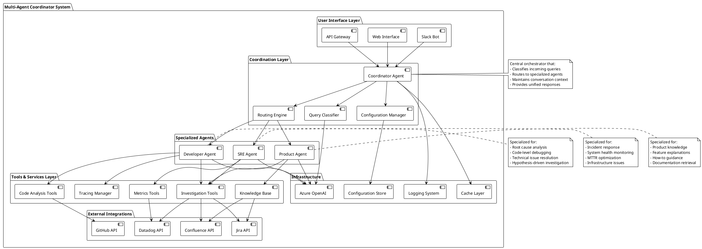
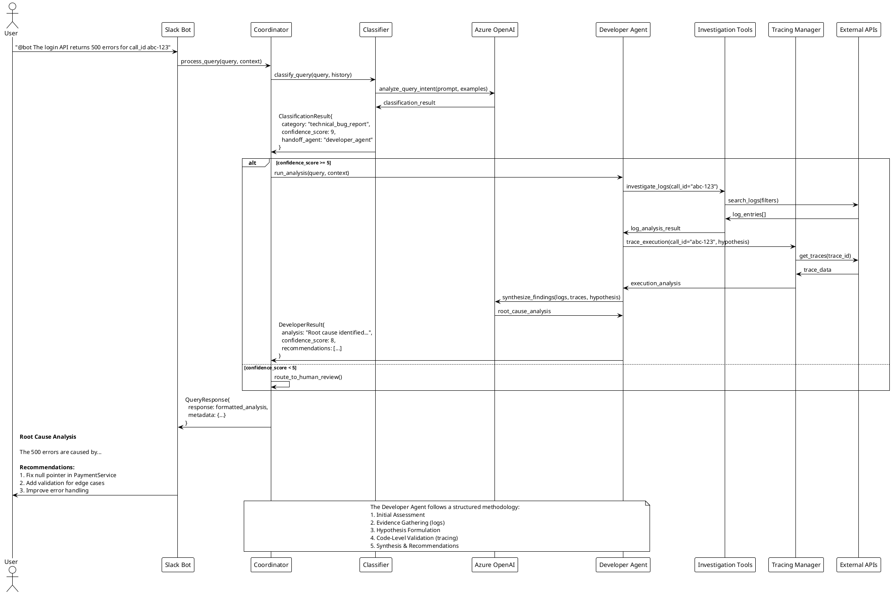

---
author:
    name: "Thinh Dang"
    avatar: "/assets/images/avatar.png"
    bio: "Experienced Fintech Software Engineer Driving High-Performance Solutions"
    location: "Viet Nam"
    email: "thinhdang206@gmail.com"
    links:
        - label: "Linkedin"
          icon: "fab fa-fw fa-linkedin"
          url: "https://www.linkedin.com/in/thinh-dang/"
toc: true
toc_sticky: true
header:
    overlay_image: /assets/images/multi-agent/banner.png
    overlay_filter: 0.5
    teaser: /assets/images/multi-agent/banner.png
title: "Building Intelligent Multi-Agent Systems with Coordinators"
tags:
    - AI
    - Multi-Agent
    - Development
    - AI Agent
---

In the rapidly evolving landscape of AI-powered applications, we're seeing a shift from monolithic single-agent systems to sophisticated multi-agent architectures. While a single AI agent might seem simpler, complex domains like incident response, customer support, and technical troubleshooting often require specialized expertise that no single agent can effectively provide.

This post explores how to build **intelligent coordinator agents** that automatically route queries to specialized expert agents, creating a system that's both more effective and more maintainable than traditional approaches.

## The Problem with Single-Agent Systems

Imagine building a technical support system. A single agent needs to handle everything from:

-   Complex code debugging and root cause analysis
-   Infrastructure outages and performance issues
-   Product how-to questions and feature explanations
-   Feature requests and business inquiries

Each of these domains requires different methodologies, tools, and expertise. A single agent becomes a "jack of all trades, master of none" - decent at everything but excellent at nothing.

## Enter the Multi-Agent Coordinator Pattern

The coordinator pattern solves this by introducing a **smart router** that:

1. **Analyzes** incoming queries to understand intent and domain
2. **Classifies** queries into specific categories
3. **Routes** queries to specialized expert agents
4. **Orchestrates** the overall response flow

Let's dive into how to implement this pattern effectively.

## Architecture Overview




Sequence diagram to handle a complex query:



## Implementation Deep Dive

### 1. Configuration-Driven Category Definition

The first key insight is making your routing logic **configuration-driven** rather than hardcoded. Here's how we define categories:

```yaml
# flow_config/coordinator.yaml
categories:
    - name: "technical_bug_report"
      instructions: >
          Classify as a technical bug report if the user is reporting that an 
          existing feature is broken, producing an error, or not behaving as expected.

          KEYWORDS: bug, error, broken, doesn't work, crash, exception, call_id

          EXAMPLES:
          - "When I click the 'Save' button, I get a 500 error. The call_id is abc-123."
          - "The login page is stuck in a loading loop."
      handoff: "developer_agent"

    - name: "infrastructure_outage_or_performance"
      instructions: >
          Classify if the problem relates to system availability, widespread 
          slowness, or core connectivity issues.

          KEYWORDS: down, slow, unavailable, outage, performance, timing out
      handoff: "sre_agent"
```

This approach provides several benefits:

-   **Easy updates** without code changes
-   **Clear documentation** of routing logic
-   **Non-technical stakeholders** can understand and modify rules
-   **A/B testing** of different routing strategies

### 2. The Coordinator Agent Implementation

Here's the core coordinator logic:

```python
class CoordinatorAgent:
    def __init__(self, config_path: str = "flow_config/coordinator.yaml"):
        self.config = self._load_config()
        self.classifier_agent = self._create_classifier_agent()

    def _create_classifier_agent(self) -> Agent:
        """Create the classification agent with dynamic prompt based on config."""

        # Build category descriptions from config
        categories_text = ""
        for i, category in enumerate(self.config.categories, 1):
            categories_text += (
                f"{i}. **{category.name}** (handoff: {category.handoff}):\n"
                f"   {category.instructions.strip()}\n\n"
            )

        prompt = f"""
You are an issue classification agent that categorizes user queries and routes
them to appropriate specialist agents.

Based on the user's query, you must classify it into one of the following categories:

{categories_text}

**Output Requirements:**
- category: The exact category name from the list above
- confidence_score: Integer from 0-10 (10 = highest confidence)
- reasoning: Clear explanation of why this category was chosen
- handoff_agent: The agent that should handle this query
"""

        return Agent(
            name="IssueClassifier",
            instructions=prompt,
            output_type=ClassificationResult,
            model=get_azure_model(),
            tools=[investigation_agent_tool],
        )
```

### 3. Structured Classification Output

The coordinator produces structured output for reliable routing:

```python
class ClassificationResult(BaseModel):
    category: str
    """The classified category name."""
    confidence_score: int
    """The confidence score from 0-10, where 10 is highest confidence."""
    reasoning: str
    """The reasoning behind the classification."""
    handoff_agent: str
    """The agent to handoff the request to."""
```

### 4. Specialized Expert Agents

Each expert agent is designed with domain-specific methodologies:

#### Developer Agent - Root Cause Analysis Specialist

```python
DEVELOPER_PROMPT = """
# ROLE & GOAL
You are a world-class **Developer Agent**, an expert in diagnosing and resolving
critical incidents in distributed software systems.

# CORE METHODOLOGY
1. **Initial Assessment**: Understand the incident's context
2. **Evidence Gathering**: Use investigation tools to query logs
3. **Hypothesis Formulation**: Create testable hypotheses about root causes
4. **Code-Level Validation**: Use tracing tools to validate hypotheses
5. **Synthesize & Conclude**: Consolidate findings into actionable recommendations

# TOOLS
- `investigation_agent_tool`: High-level log analysis
- `tracing_agent_tool`: Deep code execution tracing
"""
```

#### SRE Agent - Incident Response Specialist

```python
SRE_PROMPT = """
# ROLE & GOAL
You are a world-class **SRE Agent**, focused on Mean Time to Recovery (MTTR),
not deep root cause analysis.

# CORE METHODOLOGY
1. **Triage & Impact Assessment**: Understand blast radius and severity
2. **Evidence Gathering**: Check system health metrics and recent events
3. **Hypothesis Formulation**: Form system-level failure hypotheses
4. **Mitigation Planning**: Propose fastest, safest actions to restore service
5. **Synthesize & Conclude**: Clear impact summary and mitigation steps

# FOCUS
Prioritize rapid recovery over thorough analysis. Rollbacks over code fixes.
"""
```

## The Magic of Specialization

Each agent has fundamentally different approaches:

| Aspect             | Developer Agent             | SRE Agent                          | Product Agent                    |
| ------------------ | --------------------------- | ---------------------------------- | -------------------------------- |
| **Primary Goal**   | Root cause analysis         | Service restoration                | Knowledge sharing                |
| **Time Horizon**   | Deep investigation          | Immediate response                 | Thorough explanation             |
| **Methodology**    | Hypothesis-driven debugging | Rapid triage process               | Systematic information retrieval |
| **Success Metric** | Accuracy of diagnosis       | MTTR (Mean Time to Recovery)       | User comprehension               |
| **Tools**          | Code tracing, debugging     | Metrics, infrastructure monitoring | Documentation, knowledge base    |

This specialization leads to dramatically better outcomes than a generalist approach.

## Advanced Patterns and Best Practices

### 1. Confidence Scoring and Fallbacks

```python
async def run(self, query_context: QueryContext) -> QueryResponse:
    result = await Runner.run(self.classifier_agent, input_text)
    classification = result.final_output_as(ClassificationResult)

    # Handle low confidence classifications
    if classification.confidence_score < 5:
        logger.warning(f"Low confidence classification: {classification.confidence_score}")
        # Could route to human review or general support

    # Route to specialized agent
    if classification.handoff_agent == "developer_agent":
        final_result = await Runner.run(developer_agent, input_text)
    elif classification.handoff_agent == "sre_agent":
        final_result = await Runner.run(sre_agent, input_text)
    # ... etc
```

### 2. Context Preservation

```python
# Include conversation history for better classification
if query_context.history:
    history_text = "\n".join([
        f"{msg.get('role', 'unknown')}: {msg.get('content', '')}"
        for msg in query_context.history[-5:]  # Last 5 messages
    ])
    input_text += f"\n\nConversation History:\n{history_text}"
```

### 3. Metadata-Rich Responses

```python
return QueryResponse(
    response=final_result.get_markdown() if final_result else "No response",
    metadata={
        "category": result.category,
        "handoff_agent": result.handoff_agent,
        "confidence_score": result.confidence_score,
        "reasoning": result.reasoning,
    },
)
```

## Benefits of the Coordinator Pattern

### 1. **Specialized Expertise**

Each agent can focus on mastering their domain rather than being mediocre across all domains.

### 2. **Maintainable Architecture**

-   Easy to add new agent types
-   Clear separation of concerns
-   Independent agent development and testing

### 3. **Configurable Routing Logic**

-   Non-technical team members can update routing rules
-   A/B testing of routing strategies
-   Easy to adapt to changing business needs

### 4. **Observable and Debuggable**

-   Clear routing decisions with reasoning
-   Confidence scores for quality monitoring
-   Detailed metadata for analytics

### 5. **Scalable Development**

-   Teams can specialize in different agents
-   Parallel development of agent capabilities
-   Independent deployment and updates

## Challenges and Solutions

### Challenge 1: Classification Accuracy

**Problem**: Misclassified queries get routed to the wrong expert.

**Solutions**:

-   Comprehensive training examples in configuration
-   Confidence thresholds with human review fallbacks
-   Continuous monitoring and feedback loops
-   Regular retraining based on misclassification patterns

### Challenge 2: Agent Capability Overlap

**Problem**: Multiple agents might be able to handle certain queries.

**Solutions**:

-   Clear domain boundaries in configuration
-   Primary/secondary agent routing
-   Agent consultation mechanisms
-   Hybrid responses combining multiple agents

### Challenge 3: Context Switching Overhead

**Problem**: Routing adds latency and complexity.

**Solutions**:

-   Parallel agent pre-loading for common scenarios
-   Caching of classification decisions for similar queries
-   Streaming responses during agent processing
-   Optimized model selection per use case

## Advanced Implementation Techniques

### 1. Multi-Stage Routing

```python
# First stage: Broad category (Technical vs Product vs Business)
# Second stage: Specific sub-category within domain
async def multi_stage_classify(self, query):
    broad_category = await self.broad_classifier.classify(query)

    if broad_category == "technical":
        specific_category = await self.technical_classifier.classify(query)
        return f"technical_{specific_category}"

    return broad_category
```

### 2. Agent Ensemble Approaches

```python
async def ensemble_response(self, query, category):
    if category in ["ambiguous", "complex"]:
        # Get responses from multiple agents
        responses = await asyncio.gather(
            self.developer_agent.run(query),
            self.sre_agent.run(query),
            self.product_agent.run(query)
        )

        # Use a meta-agent to synthesize the best response
        return await self.synthesis_agent.combine(responses, query)

    return await self.single_agent_response(query, category)
```

### 3. Dynamic Agent Loading

```python
class CoordinatorAgent:
    def __init__(self):
        self.agent_registry = {}
        self.load_agents_from_config()

    def load_agents_from_config(self):
        """Dynamically load agents based on configuration"""
        for agent_config in self.config.agents:
            agent_class = import_class(agent_config.class_path)
            self.agent_registry[agent_config.name] = agent_class(agent_config.params)

    async def route_to_agent(self, agent_name: str, query: str):
        if agent_name not in self.agent_registry:
            raise ValueError(f"Unknown agent: {agent_name}")

        return await self.agent_registry[agent_name].run(query)
```

## Conclusion

Multi-agent coordinators represent a powerful architectural pattern for building sophisticated AI systems. By embracing specialization over generalization, we can create systems that are:

-   **More effective** at solving complex problems
-   **More maintainable** with clear separation of concerns
-   **More scalable** for teams and development processes
-   **More adaptable** to changing requirements

The key insight is that **intelligence isn't just about individual agent capabilities—it's about orchestrating specialized agents effectively**. A well-designed coordinator can make the sum greater than its parts.

As AI systems become more complex and handle more diverse use cases, the coordinator pattern will become increasingly essential. Start simple, measure everything, and let your system evolve based on real usage patterns.

The future of AI isn't a single superintelligent agent—it's intelligent orchestration of specialized AI experts working together seamlessly.
