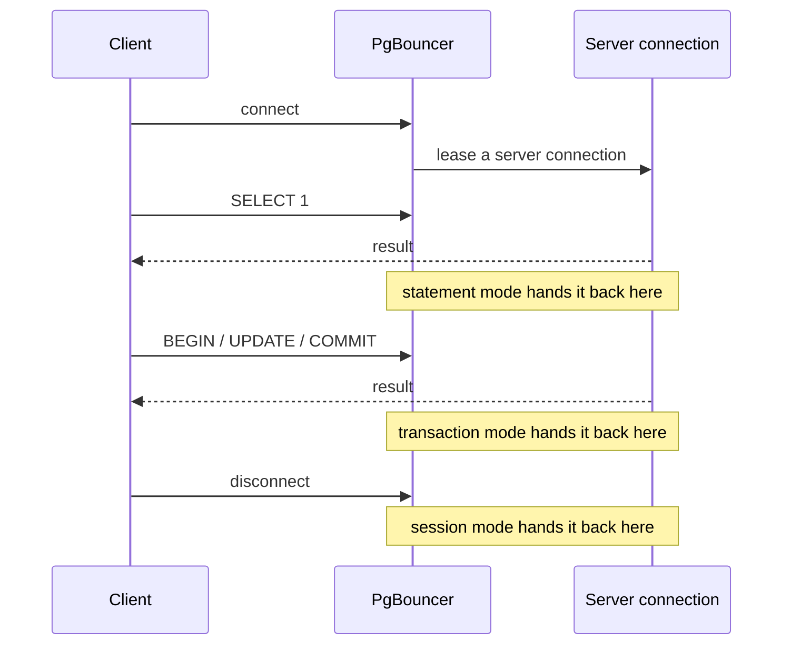
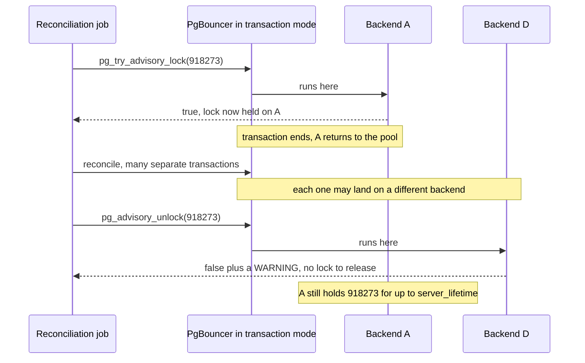

At 02:40 the nightly reconciliation job stops running. Not crashing — stopping. The
scheduler says it dispatched the run, the worker log says it acquired the lock and then
nothing, and `pg_stat_activity` shows a backend idle, holding an advisory lock nobody
is waiting on. You restart the worker. It works. The next night it happens again, on a
different shard.

Three weeks earlier somebody flipped `pool_mode` from `session` to `transaction` in
PgBouncer, because the connection count was climbing and the change made the graphs
look better. It did. It also quietly changed the answer to a question your application
never asked out loud: how long does a session last?

## The mode is a contract about who owns session state

PgBouncer's three modes differ mainly in when a server connection goes back into the
pool — and the most aggressive adds a restriction on top.

Session pooling is the default and the most conservative: "Server is released back to
pool after client disconnects." Transaction pooling releases it "after transaction
finishes." Statement pooling releases it "after query finishes," and "Transactions
spanning multiple statements are disallowed in this mode."

The difference is one question asked at three different moments — when does this
server connection go back in the pool?



Read those as a contract, not a performance knob. In session mode, a client's session
state — `SET search_path`, a prepared statement, a temp table, an advisory lock — lives
as long as its connection, which is what every Postgres driver assumes. In transaction
mode, the docs are blunt: "This mode breaks a few session-based features of
PostgreSQL."

"A few" is doing a lot of work. The feature-compatibility table names `SET`/`RESET`,
`LISTEN`, `WITH HOLD CURSOR`, `PREPARE`/`DEALLOCATE`, `PRESERVE`/`DELETE ROWS` temp
tables, `LOAD`, and session-level advisory locks — most of the surface an ORM touches
when it configures a connection.

The state-setting half of that list fails *silently*. Your `SET statement_timeout`
applies to one transaction and then evaporates; your advisory lock lands on a backend
you will never see again. The bug reads as correct under low concurrency — one client
and a pool of twenty keeps hitting the same backend — and wrong under load, because it
doesn't. The prepared-statement entries are the loud exception, below.

## The worked example: a lock that outlives its owner

Here is that job, written the way almost everyone writes a mutex.

```python
# BROKEN behind pool_mode = transaction.
import psycopg

JOB_KEY = 918_273

def run_reconciliation(dsn: str) -> None:
    with psycopg.connect(dsn) as conn:
        conn.autocommit = True
        with conn.cursor() as cur:
            # Session-level lock: held "until explicitly released or the
            # session ends" -- but *this* session is a PgBouncer client
            # session, not a Postgres backend session.
            cur.execute("SELECT pg_try_advisory_lock(%s)", (JOB_KEY,))
            if not cur.fetchone()[0]:
                return  # someone else is reconciling

        try:
            reconcile(conn)          # many separate transactions
        finally:
            with conn.cursor() as cur:
                cur.execute("SELECT pg_advisory_unlock(%s)", (JOB_KEY,))
```

Traced through the pool, the lock and its release never meet:



Under session pooling this is fine. Under transaction pooling each `execute` is its own
transaction, so each may land on a different backend. The `pg_try_advisory_lock` — which
"will either obtain the lock immediately and return `true`, or return `false` without
waiting" — runs on backend A. `reconcile()` runs across B and C. The
`pg_advisory_unlock` runs on backend D, where the lock was never held, so "`false` is
returned, and in addition, an SQL warning will be reported by the server." Nobody
checks the return value, and a `WARNING` reaches the client as a notice, not an
exception — so nothing stops.

Backend A still holds the lock, and Postgres holds it "until explicitly released or the
session ends" — where "the session" is a pooled server connection. It is not immortal;
PgBouncer recycles that connection under `server_lifetime` (default 3600 seconds) or
`server_idle_timeout` (default 600). It is just held for up to an hour by a connection
nothing is watching — long enough for the next run to get `false` and return silently.
That is your 02:40.

The fix is not session mode. It is to stop asking for state that outlives a
transaction:

```python
import psycopg

JOB_KEY = 918_273

def run_reconciliation(dsn: str) -> None:
    with psycopg.connect(dsn) as conn:
        with conn.transaction():
            with conn.cursor() as cur:
                # Transaction-level lock: "automatically released at the end
                # of the transaction, and there is no explicit unlock
                # operation."
                cur.execute("SELECT pg_try_advisory_xact_lock(%s)", (JOB_KEY,))
                if not cur.fetchone()[0]:
                    return
            reconcile_in_this_transaction(conn)
        # COMMIT releases the lock. A crash releases it too.
```

This is better even without a pooler: a transaction-level lock cannot leak, because
there is no unlock call to forget and no session to strand. If the work cannot fit in
one transaction, the mutex does not belong in session state at all — put a row in a
table with an owner and a heartbeat, and expire it.

## Prepared statements are the other half of the bill

The second thing transaction pooling breaks is the one your driver does behind your
back. asyncpg prepares statements automatically, and its FAQ names the symptom:
intermittent `prepared statement "__asyncpg_stmt_xx__" does not exist` or
`already exists` errors, because "pgbouncer, when in the `"transaction"` or
`"statement"` pooling mode, does not support prepared statements." Its fixes are to
"switch to the connection pool functionality provided by asyncpg", to pass
`statement_cache_size=0`, or to "switch pgbouncer's `pool_mode` to `session`."

Since PgBouncer 1.21.0 there is a fourth, and it is the one to reach for. With
`max_prepared_statements` non-zero, PgBouncer "tracks protocol-level named prepared
statements related commands sent by the client in transaction and statement pooling
mode," rewriting them so a statement prepared on one backend still works when the
client lands on another. Read *protocol-level* carefully, because the docs qualify it:
"This tracking and rewriting of prepared statement commands does not work for SQL-level
prepared statement commands, so `PREPARE`, `EXECUTE` and `DEALLOCATE` are forwarded
straight to Postgres." If your code emits literal `PREPARE` SQL, this did nothing for
you.

Check the value rather than assuming it. On release, "to benefit from this new feature
you need to change the new `max_prepared_statements` setting to a non-zero value" — it
was off. That held until 1.24.0 (January 2025): "Enable prepared statement support by
default, `max_prepared_statements` is now set to 200 by default."

One more setting, before you go looking for a cleanup that isn't happening:
`server_reset_query` defaults to `DISCARD ALL`, but `server_reset_query_always` is off
by default, and when off "the `server_reset_query` will be run only in pools that are
in sessions-pooling mode." Transaction-mode pools skip `DISCARD ALL` deliberately — it
would discard the cached state transaction mode exists to reuse — but nothing is
sweeping up after a `SET` that leaked.

## Pick the mode from `maxwait`, not from the connection count

The usual reason to reach for transaction mode is a connection count that looks
alarming. Check first whether it's what's hurting you.

`max_connections` "can only be set at server start," and Postgres "sizes certain
resources based directly on the value of `max_connections`," so raising it is not free.
But *idle* connections got much cheaper in Postgres 14, which improved "the speed of
computing MVCC visibility snapshots on systems with many CPUs and high session counts"
and "also improves performance when there are many idle sessions." The patch author's
benchmark of one active read-only pgbench connection alongside 10,000 idle ones moved
from 16,034 TPS to 33,140 TPS. On 14 or later, idle connections are a smaller problem
than the folklore says.

The number that tells you whether pooling is the bottleneck is in PgBouncer's admin
console:

```sql
-- psql -p 6432 pgbouncer   -- 6432 is the default listen_port
SHOW POOLS;
```

Watch two columns. `cl_waiting` is "client connections that have sent queries but have
not yet got a server connection." `maxwait` is "how long the first (oldest) client in
the queue has waited, in seconds" — and the docs tell you how to read a rising value:
"the current pool of servers does not handle requests quickly enough. The reason may be
either an overloaded server or just too small of a `pool_size` setting."

Note what that does *not* say: switch pooling modes. `maxwait` climbing with
`sv_active` pinned at `default_pool_size` (20 by default, against a `max_client_conn`
of 100) is a pool-size problem, and raising `default_pool_size` costs nothing
semantically. `maxwait` climbing while servers sit in `sv_idle` — "unused and
immediately usable for client queries" — is a client-side problem, which transaction
mode will not fix either.

Transaction pooling earns its keep when you have more concurrent *clients* than you can
afford backends for and those clients are idle most of the time: serverless functions,
short-lived workers, anything where connection setup dominates query time. Go in
knowing what you trade away, audit where your code assumes session state — `SET`,
`LISTEN`, advisory locks — and check `max_prepared_statements` on your version before
your driver finds out the hard way.

## Further reading

- [PgBouncer — Features](https://www.pgbouncer.org/features.html): pooling modes, plus
  the SQL feature compatibility table.
- [PgBouncer — Configuration](https://www.pgbouncer.org/config.html): `pool_mode`,
  `max_prepared_statements`, `server_lifetime`, `server_reset_query_always`,
  `listen_port`.
- [PgBouncer changelog](https://www.pgbouncer.org/changelog.html); the
  [1.21.0 announcement](https://www.postgresql.org/about/news/pgbouncer-1210-released-now-with-prepared-statements-2735/).
- [PgBouncer — Usage](https://www.pgbouncer.org/usage.html): `SHOW POOLS`.
- [PostgreSQL — Advisory Locks](https://www.postgresql.org/docs/current/explicit-locking.html)
  and [the functions](https://www.postgresql.org/docs/current/functions-admin.html).
- [asyncpg FAQ — "Why am I getting prepared statement errors?"](https://magicstack.github.io/asyncpg/current/faq.html)
- [PostgreSQL 14 release notes](https://www.postgresql.org/docs/14/release-14.html);
  Andres Freund's [Improving Postgres Connection Scalability: Snapshots](https://www.citusdata.com/blog/2020/10/25/improving-postgres-connection-scalability-snapshots/).
- [PostgreSQL — `client_min_messages`](https://www.postgresql.org/docs/current/runtime-config-client.html).
