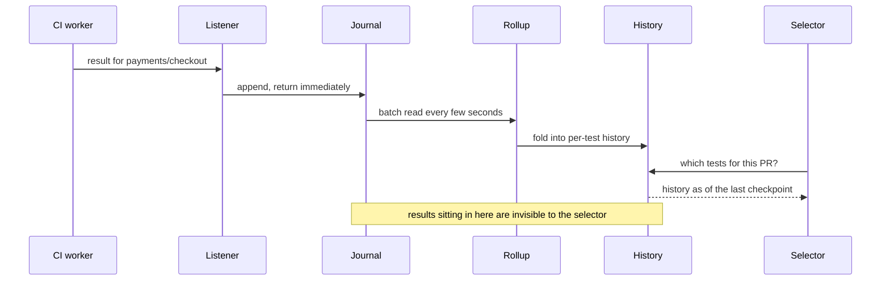

In March, a small internal service at Anthropic hit its memory ceiling "by mid-afternoon
on most weekdays." Not the test runners. Not the queue. The thing that decides which tests
a pull request runs. And it paged — it had been paging since the previous October, when
"the service was already showing signs of strain, and we got paged two days straight."

The pages are not the interesting part. What it did between them is: kept answering, from
a picture of the world that was increasingly out of date.

Sachin Malhotra wrote it up on 14 September 2026, and the context is what changed:
engineers there "ship 8x as much code per quarter as they did from 2021-2025," "Claude
authors 80% of that code," "the amount of tests across our codebase grew 10x," and CI saw
"a 25x increase in CI jobs over a six month period."

None of that is a test-runner problem. Runners scale by adding runners. The part that does
not is the part that has to remember things.

## The half of test impact analysis that accumulates state

Test impact analysis — run the tests a change could break, skip the rest — splits into two
jobs: "a 'listener' records the test results from every CI run. A 'selector' reads the
test result history and determines which tests run on which opened PRs."

The selector is a read path, and reads scale easily: put the history somewhere, add
replicas.

The listener is the half that accumulates. The post does not describe its internals, so
what follows is my reading of the symptoms, not their account of the code. A listener that
folds each result into a per-test history it holds locally does a read-modify-write
against a structure growing with tests times packages times retained runs. Multiply the
test count by ten and the job volume by twenty-five and you have not made it twenty-five
times busier — you have made it hold a much bigger thing while touching it far more often.

## Three patches, each buying less time than the last

The instructive part is not the redesign. It is the sequence before it, the same one most
teams run: "three quick fixes, which lasted 70 days, then 29 days, and then less than a
day respectively."

First they "doubled the cores running the service." Then they "split each package's state
into a shard with its own worker." Then restarts.

Seventy days, twenty-nine days, less than one. Read that as a series rather than three
incidents. Each patch bought headroom against a compounding load, so each bought less than
the one before by construction. The signal that you are in this regime is not any single
alert — it is **the shrinking interval between your own mitigations**, a number nobody
graphs and everybody has.

One habit follows: date every capacity bump you give a service. When the gaps start
halving, stop patching — you are not behind on capacity, you are wrong about the
architecture.

## Lag does not break the selector, it makes it answer from a stale world

Staleness, not failure, is what makes a stateful listener more dangerous than a slow one.

When the listener falls behind, the selector does not error. It answers — out of whatever
history has been applied, missing everything the listener has not caught up on. That lag
is what was paging them: "we were getting paged pretty frequently by the lag building up
in the listener of this service." Anthropic puts a number on the gap: "20 minutes of
listener lag can translate into tens of thousands of test updates not being applied to the
selector."

What that did is not the consequence most people guess: "mostly this translated into us
running tests that were already super flaky or widespread-failing across the board." The
stale selector did not go quiet. It went **expensive** — spending CI capacity on tests
whose recent history, had it arrived, would have said not to bother. A service whose
purpose is to not run tests was running the least informative ones available, exactly when
the system could least afford it.

The reverse direction — stale history causing a test that *should* run to be skipped — is
worth worrying about, though that is my inference, not their reported finding. Selection
is already a recall trade you made on purpose. Meta's predictive test selection paper is
explicit: in production it "reduces the total infrastructure cost of testing code changes
by a factor of two, while guaranteeing that over 95% of individual test failures and over
99.9% of faulty changes are still reported back to developers." You accepted a small miss
rate to halve the bill; a freshness gap spends that budget without appearing in any number
you watch.

Either way, the metric to alert on is not listener CPU, memory or queue depth, but the age
of the newest result the selector cannot see yet.

## Reshaping the listener so it holds nothing

The fix Anthropic landed on is standard because it works: "we gave the test selection
service a database... any listener worker can process any result, append it to a journal
in the in-memory store, and move on without holding anything in memory - stateless and
hence, horizontally scalable." A separate consumer folds the journals into per-test
history every few seconds.

They do not name their store, so the code below is my illustration, not their
implementation. In Python against Redis Streams, the listener is this:

```python
# listener.py - one of N identical workers. Holds no per-test state.
import json
import time

import redis

r = redis.Redis(decode_responses=True)
STREAM = "tia:journal"

def record(result: dict) -> None:
    """Append one result and return. No read-modify-write, so no growing footprint."""
    result["received_at"] = time.time()
    # MAXLEN ~ is approximate trimming: cheaper, and "may leave slightly more
    # entries than the threshold", which is fine for a bounded journal.
    r.xadd(STREAM, {"payload": json.dumps(result)}, maxlen=5_000_000, approximate=True)
```

Every worker runs that function, so the fleet scales by adding processes. The folding
moves into its own consumer:

```python
# rollup.py - reads the journal in batches and updates per-test history.
GROUP = "rollup"
CHECKPOINT = "tia:rollup:checkpoint"

# Create the group once. XGROUP CREATE "returns a -BUSYGROUP error" if it already
# exists, and MKSTREAM creates "the stream as an empty stream if it does not already exist".
try:
    r.xgroup_create(STREAM, GROUP, id="0", mkstream=True)
except redis.ResponseError:
    pass                                     # already created

def roll_once(consumer: str, batch: int = 5000) -> int:
    # ">" delivers only entries never handed to another consumer in this group.
    entries = r.xreadgroup(GROUP, consumer, {STREAM: ">"}, count=batch, block=2000)
    if not entries:
        return 0
    _, messages = entries[0]
    pipe = r.pipeline()
    for message_id, fields in messages:
        result = json.loads(fields["payload"])
        key = f"tia:history:{result['test_id']}"
        pipe.lpush(key, json.dumps({"status": result["status"], "sha": result["sha"]}))
        pipe.ltrim(key, 0, 99)               # keep the last 100 runs per test
        pipe.xack(STREAM, GROUP, message_id)  # XACK is what clears the PEL entry
    # Same MULTI/EXEC as the writes above: the checkpoint cannot land without them.
    pipe.set(CHECKPOINT, messages[-1][0])
    pipe.execute()
    return len(messages)
```

That checkpoint is doing the real work. It is tempting to read freshness off the consumer
group, but Redis defines `last-delivered-id` as "the ID of the last entry delivered to the
group's consumers" — delivered, not folded into history. Delivery precedes the work, so a
stuck rollup reports itself caught up. The checkpoint goes in the same `MULTI`/`EXEC` as
the history writes it covers, so it can never become visible ahead of them. The gauge is
then a subtraction against that checkpoint:

```python
def listener_lag_seconds() -> float:
    """Age gap between the newest journal entry and the newest one rolled into history."""
    newest = r.xrevrange(STREAM, count=1)
    if not newest:
        return 0.0
    # An auto-generated stream ID is "<unix-ms>-<seq>".
    newest_ms = int(newest[0][0].split("-")[0])
    committed = r.get(CHECKPOINT)
    if committed is None:
        return float("inf")                  # nothing rolled up yet: not "zero lag"
    return max(0.0, (newest_ms - int(committed.split("-")[0])) / 1000)
```

One rollup consumer, deliberately: `>` splits entries across the group, so a second
consumer would race this checkpoint past entries its sibling has not folded. Scaling out
means one checkpoint per consumer and a gauge taking the oldest.

Traced end to end, the gap has a name and a place to live:



The selector never talks to the listener, and the separation is deliberate: the only thing
connecting a freshly recorded failure to the next selection decision is the rollup
interval — a number you set and measure.

## Wire the gauge into CI, and fail open

A gauge nobody consults is decoration. Wire it into the selection call: when lag exceeds a
threshold you set, the selector declines to answer and CI runs everything. Skipping tests
on a stale picture is the risk; running too many is the cost. Fail toward the cost.


```yaml
# .github/workflows/tests.yml
name: tests
on: pull_request

jobs:
  select:
    runs-on: ubuntu-latest
    outputs:
      tests: ${{ steps.pick.outputs.tests }}
    steps:
      - uses: actions/checkout@v7
        with:
          # "0 indicates all history for all branches and tags" - and the full
          # fetch is also what makes origin/<base_ref> resolvable below.
          fetch-depth: 0
      - id: pick
        run: |
          base=$(git merge-base "origin/${{ github.base_ref }}" HEAD)
          # --max-lag-seconds makes the selector refuse to answer from a stale
          # picture. A non-zero exit falls back to ALL; so does empty output, so
          # a soft failure cannot silently shrink the suite either.
          # select.py prints one space-separated line of test paths.
          tests=$(python3 select.py --since "$base" --max-lag-seconds 120) || tests=ALL
          [ -n "$tests" ] || tests=ALL
          echo "tests=$tests" >> "$GITHUB_OUTPUT"

  run:
    needs: select
    runs-on: ubuntu-latest
    steps:
      - uses: actions/checkout@v7
      - env:
          # Pass the value through the environment. A ${{ }} expression is spliced
          # into the script as source before bash parses it, so a path containing
          # $(...) or ; would execute; as $TESTS it stays data.
          TESTS: ${{ needs.select.outputs.tests }}
        run: |
          if [ "$TESTS" = ALL ]; then
            pytest
          else
            pytest $TESTS          # unquoted on purpose: split the list into args
          fi
```


That fallback is the point: a selector that is down, slow, or stale never silently shrinks
the test set — it degrades into the CI you had before.

## If you do not have a selector yet, start with the graph you already have

Building history-based selection is the second step. If your build system knows your
dependency graph, it knows what a change can reach — Bazel's `rdeps()` takes "a
`universe_scope` — the relevant directory — and a `target`," and searches "for the
target's reverse dependencies within the `universe_scope` provided":

```bash
bazel query "rdeps(//... , //src/main/java/com/example/ingredients:cheese)"
```

That over-selects everything transitively reachable — the safe direction to be wrong in —
with no history, no service and no lag metric to keep fresh. Take on a history-based
selector only when the static answer is too big to run.

## Tradeoffs worth saying out loud

The redesign is not free: it is "more expensive to run, but... much easier to scale and
memory profile." You buy a hop, a journal and a consumer, for a failure mode you can see.

And the honest bound: if your full suite runs in ten minutes, do not build any of it. Run
everything.

What generalizes is the sizing rule: "assume your architecture will be at a 25x load
within two quarters," and "keep state out of the process from the start." That used to be
paranoid. With agents writing the diffs, it is what happened to somebody already paying
attention.

## Key takeaways

- The listener accumulates state; the selector does not, so the listener fails first — by
  going stale rather than erroring. Anthropic's symptom was re-running tests already known
  broken.
- Graph the interval between your capacity patches. A halving sequence is an architecture
  problem, not a capacity one.
- Alert on the gap between the newest recorded result and the newest one the selector can
  see, from a checkpoint that commits with the history writes.
- Fail open: a stale or unreachable selector should run everything, not quietly run less.

## Further reading

- [Agentic coding is straining CI. Here's how we scaled test impact analysis at Anthropic](https://claude.com/blog/agentic-coding-is-straining-ci-heres-how-we-scaled-test-impact-analysis-at-anthropic) — Sachin Malhotra on the incident, the three patches and the redesign.
- [Predictive Test Selection](https://arxiv.org/abs/1810.05286) — Machalica et al., on trading recall for cost deliberately and measuring what you gave up.
- [Bazel query quickstart](https://bazel.build/query/quickstart) — `rdeps()` and computing the affected set from the graph you already have.
- [Redis XINFO GROUPS](https://redis.io/docs/latest/commands/xinfo-groups/) — why `last-delivered-id` is the wrong thing to measure freshness with.
