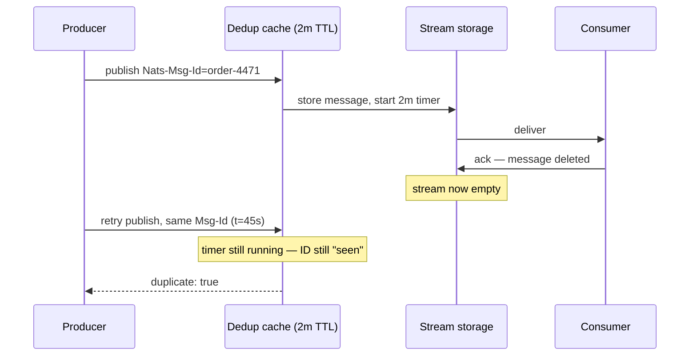

---
author:
    name: "Thinh Dang"
    avatar: "/assets/images/avatar.png"
    bio: "Experienced Fintech Software Engineer Driving High-Performance Solutions"
    location: "Viet Nam"
    email: "thinhdang206@gmail.com"
    links:
        - label: "Linkedin"
          icon: "fab fa-fw fa-linkedin"
          url: "https://www.linkedin.com/in/thinh-dang/"
toc: true
toc_sticky: true
header:
    overlay_image: /assets/images/nats-jetstream-dedup-window/banner.webp
    overlay_filter: 0.5
    teaser: /assets/images/nats-jetstream-dedup-window/teaser.webp
title: "The NATS JetStream Dedup Window That Outlives Your Message"
tags:
    - NATS
    - distributed messaging
categories:
    - distributed-systems
description: "JetStream's Nats-Msg-Id dedup window rejects retries by the clock, not by whether the original message still exists — here's the worked example and the fix."
---

Your worker acks a payment-capture message, the stream drops it — `messages: 0`, confirmed — and thirty seconds later a legitimate retry for the exact same order gets bounced with `"duplicate": true`. Nothing is stuck. Nothing is stale. The message you're trying to publish again doesn't exist anywhere in the stream. JetStream rejects it anyway.

This is not a bug you hit by misconfiguring something exotic. It's the default behavior of the feature everyone reaches for first when they want "exactly-once" out of JetStream: the `Nats-Msg-Id` dedup window.

## The header that's supposed to save you

JetStream's pitch on deduplication is simple and, read quickly, reassuring. Tag a publish with a `Nats-Msg-Id` header, and if the same ID shows up again inside a configured window, the server turns it away instead of storing a second copy:

> "For two minutes after a message is stored, the server turns away a second message that carries the same `Nats-Msg-Id` header. This is what lets you publish the same message twice without storing it twice."

Two minutes is the default `duplicate_window` on a stream. It's a stream-level setting, and the header itself is documented plainly enough: "Unique message ID for deduplication. Messages with the same ID within the deduplication window will be rejected as duplicates."

Read that sentence and it's easy to form a mental model where the dedup window is *about the message* — it tracks whether this specific message is still live, and once it's gone (acked, purged, delivered and consumed), the ID is free again. That model is wrong, and it's wrong in a way that only shows up under retry pressure, which is exactly when you can least afford it.

## The window doesn't know the message left

A workqueue-retention stream is built to make messages disappear the moment they're acked: "the first ack removes the message for everyone." So it's a reasonable guess that acking a message would also clear its `Nats-Msg-Id` out of the dedup table. It doesn't.

Someone filed exactly this as a bug against `nats-server`: after acking a message with `Nats-Msg-Id: 123` on a workqueue stream — confirmed empty, `"messages":0` — republishing the same ID immediately came back `"duplicate": true`. The maintainer's answer wasn't a fix, it was a correction to the mental model, from Derek Collison himself:

> "That is by design, the duplicate window does not update based on acks etc. I feel that could be very bad from an experience perspective. Is it possible to pick more unique msg ids?"

The dedup table is a clock, not a ledger. It doesn't consult the stream to see whether the message is still there. It remembers *an ID it has seen*, for *a fixed duration from when it saw it*, full stop. Message lifecycle and dedup lifecycle are two independent timelines that happen to start at the same instant and then diverge the moment anything acks, expires, or gets purged early.

```go
js, _ := jetstream.New(nc)
stream, _ := js.CreateStream(ctx, jetstream.StreamConfig{
    Name:            "ORDERS",
    Subjects:        []string{"orders.capture"},
    Retention:       jetstream.WorkQueuePolicy,
    Duplicates:      2 * time.Minute, // the default — set explicitly here for clarity
})

ack, _ := js.Publish(ctx, "orders.capture", payload, jetstream.WithMsgID("order-4471"))
// ack.Duplicate == false — first time this ID has been seen

// ... a consumer pulls it, processes it, and calls msg.Ack() ...
// the stream is now empty for this message: gone from storage, gone from the workqueue

retry, _ := js.Publish(ctx, "orders.capture", payload, jetstream.WithMsgID("order-4471"))
// retry.Duplicate == true — rejected, even though nothing with this ID exists anywhere
```

`retry.Duplicate` comes back `true` for up to the full two minutes after the *first* publish, regardless of what happened to that message in between. If your retry logic assumes "duplicate means the original is still in flight," it will silently drop a legitimate resend and you'll spend an afternoon staring at a stream that insists it has zero messages while your publisher insists one already exists.



Two clocks, one visible only in the server's memory, and nothing in the PubAck tells you which one just fired.

## Why the window is a map, not a ledger

The dedup tracking structure is also blunter internally than "ledger" implies. It's an in-memory map, no disk backing, no LRU eviction — every ID published inside the window holds an active entry until its own timer runs out, at roughly 130–150 bytes per entry. Push 10,000 messages per second through a one-hour window and that's on the order of 5 GB held just for dedup bookkeeping, and Go's runtime doesn't hand freed heap back to the OS promptly once the map shrinks, so baseline memory ratchets upward across the life of the process instead of settling back down.

That's the operational argument for keeping `duplicate_window` as short as your publisher's actual retry behavior needs, not a conservative "let's be safe" hour. A long window doesn't just widen the surface for the ack-then-retry trap above — it's also a standing memory bill.

## What "exactly-once" is actually promising

JetStream does advertise exactly-once semantics, and that part is real — it's just narrower than the dedup window alone. It's the combination of `Nats-Msg-Id` deduplication on the publish side with a **double ack** on the consume side: instead of firing an ack and hoping, the client calls the double-ack variant (`AckSync` in Go, `ackSync()` in Java, `ack_sync()` in Python) and blocks until the server confirms the ack was actually recorded. That closes the gap where a client thinks it acked, the network drops the ack, and the server redelivers the message at the default 30-second ack-wait — a straightforward at-least-once retry, unrelated to the dedup table.

Double-acking makes *ack delivery* exactly-once. It says nothing about how long an ID stays "seen" by the dedup cache, because that's governed entirely by `duplicate_window`, on its own clock, as the GitHub thread above confirms.

## Use a durable limit instead of a clock

If what you actually want is "this logical message can never be double-processed, no matter how long the retry takes," don't fight the window — sidestep it. Give each message its own subject (or a subject suffix carrying the ID) and cap the stream at one message per subject with a per-subject discard-new policy:

```go
stream, _ := js.CreateStream(ctx, jetstream.StreamConfig{
    Name:                  "ORDERS",
    Subjects:              []string{"orders.capture.*"}, // orders.capture.<order-id>
    MaxMsgsPerSubject:     1,
    DiscardNewPerSubject:  true, // requires Discard: DiscardNew
    Discard:               jetstream.DiscardNew,
})
```

As long as the original message for `orders.capture.4471` is still retained, a second publish to that subject is rejected outright — not for two minutes, but for as long as the message lives in the stream. The NATS team describes this combination as "infinite exactly-once publication quality of service," and the mechanism is the one already doing the enforcement work in JetStream: a per-subject storage limit, not a time-boxed cache.

## Key takeaways

- `Nats-Msg-Id` deduplication is a wall-clock window, not a message-presence check — acking, purging, or otherwise removing a message does not clear its ID out of the dedup cache early.
- A long `duplicate_window` is also a standing memory cost: an unbounded in-memory map with no eviction until each entry's own timer expires.
- Double-acking (`AckSync`) makes ack delivery reliable; it does not change dedup-window behavior, which is a separate mechanism on a separate clock.
- When retries can legitimately outlive a short window, replace the time-boxed dedup window with a per-subject `MaxMsgsPerSubject: 1` + `DiscardNewPerSubject` limit tied to the message's own identity.

## Further reading

- [Streams — NATS Docs](https://docs.nats.io/nats-concepts/jetstream/streams)
- [Retention policies — NATS Docs](https://docs.nats.io/learn/jetstream/retention-policies)
- [`duplicate_window` reference — NATS Docs](https://docs.nats.io/reference/config/jetstream/limits/duplicate_window)
- [JetStream headers reference — NATS Docs](https://docs.nats.io/reference/jetstream/api/headers)
- [Jetstream workqueue duplicate window is not cleared for message when ack'ed — nats-server#2921](https://github.com/nats-io/nats-server/issues/2921)
- [NATS Large Deduplication Window: Causes, Diagnosis, and Fixes — Synadia Insights](https://www.synadia.com/insights/checks/nats-large-deduplication-window)
- [Delivery and acknowledgment — NATS Docs](https://docs.nats.io/learn/jetstream/delivery-and-acknowledgment)
- [Infinite message deduplication in JetStream — NATS Blog](https://nats.io/blog/new-per-subject-discard-policy/)
- [Surviving node loss — NATS Docs](https://docs.nats.io/learn/jetstream/surviving-node-loss)
