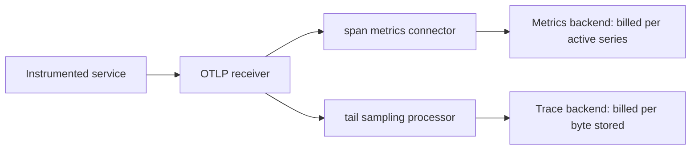

Finance wants to know why observability went up forty percent month over month, and
you check span volume first because that is the number everyone reaches for. Flat.
Bytes into the trace backend: flat. Head sampling rate: unchanged at one percent.
Nothing shipped that emits more spans.

What shipped was one line in a Collector config three weeks ago, adding `tenant.id` to
the span metrics connector's dimension list. Somebody wanted per-tenant latency on a
dashboard, and they got it. They also got a new metric time series for every
combination of tenant and operation that has appeared recently, and *that* is the
number that moved.

The instinct to look at span volume is the problem. Your traces and your span-derived
metrics are billed on two different axes, and sampling — the one lever everybody
reaches for — only moves one of them.

## Traces are priced by the byte; metrics are priced by the series

Trace storage is a volume problem and behaves like one. Tempo "stores all trace data in
object storage" and "backend workers enforce retention by expiring data in object
storage after the configured retention period." Your bill is roughly bytes per day
times retention days. Halve the spans, halve the bytes, halve the bill. The
relationship is linear and the knob is sampling.

Metrics are not a volume problem. Grafana Cloud's definition is blunt: "an active
series is a time series that has received new data points within the previous 20
minutes." Data points per minute is tracked as a *separate* axis — "DPM is the number
of data points sent to Grafana Cloud Metrics per minute per series." So a series
receiving one sample a minute and a series receiving sixty are both exactly one active
series. The count of distinct series and the count of samples are priced
independently.

That distinction is the whole post. A span attribute that becomes a metric dimension
stops being a volume question and becomes a *distinctness* question, and distinctness
does not respond to the lever you have.

## Sampling is a volume knob, and cardinality is not a volume

Here is the arithmetic that surprises people.

A dimension's contribution to your series count is the number of distinct values that
appear **at least once** in the active window. Not how often each appears — whether it
appears. Sampling divides how often. It barely touches whether.

Take head sampling at one percent. The decision there "is made based on the trace ID
and the desired percentage of traces to sample," which "ensures that whole traces are
sampled — no missing spans — at a consistent rate." So the coin is flipped once per
trace, not once per span: a tenant making `k` requests inside a 20-minute window gets
`k` independent flips. The probability that tenant shows up in the sampled stream at
all is `1 - 0.99^k`. At `k = 100`, that is about 63 percent. At `k = 500`, it is 99.3
percent.

Read that as a ratio. You cut ingested bytes by 100×. You cut the tenant dimension's
contribution to series count by about 1.6× — and once your busier tenants cross a few
hundred requests per window, by nothing at all. A hundredfold reduction on one axis
buys you roughly a third off the other, and only on your quietest tenants.

Tail sampling is worse, not better, because of where it sits.

## The fork in the pipeline is where the two bills separate

A Collector running span metrics has two paths out of one receiver. The connector
consumes the trace stream and emits a metrics stream; the sampler sits on the trace
path and decides what reaches storage. You almost always want the connector *upstream*
of the sampler, because "tail sampling is where the decision to sample a trace takes
place by considering all or most of the spans within the trace" — and a sampler that
deliberately keeps errors and slow traces hands the connector a population it has
already skewed. Aggregate before you drop, or your request rate is wrong.

Which means the sampler is on one branch only:



The sampler never touches the branch that generates series. Every span the receiver
accepts contributes its dimension values to the metrics stream, at full volume,
whatever the sampling rate says. Turning sampling down to 0.1 percent changes the
bottom branch and leaves the top one exactly where it was.

## Bucket the attribute, don't delete it

The fix is not to stop recording tenant. It is to stop letting tenant be a *dimension*,
while leaving it on the span where it is cheap — byte-priced, sampled, and still there
when you open a trace and ask which tenant this was.

OpenTelemetry's semantic conventions already encode this discipline. `http.route` is
"the matched route template for the request. This MUST be low-cardinality and include
all static path segments, with dynamic path segments represented with placeholders."
The spec even forecloses the shortcut: the route attribute "MUST NOT be populated when
this is not supported by the HTTP server framework as the route attribute should have
low-cardinality and the URI path can NOT substitute it." Route is the label. Path is
the span attribute. Same split, applied to your own identifiers.

Config below is written against the `span_metrics` connector and `transform` processor
as documented on `opentelemetry-collector-contrib` main — note the underscore, since
`spanmetrics` is now a deprecated alias. It shows only the parts under discussion; the
`otlp` receiver, the exporters and `tail_sampling`'s own `policies` list still need
their top-level definitions.

```yaml
processors:
  # Runs before the connector, so tenant.tier exists by the time dimensions are read.
  # tenant.id is never listed as a dimension, so it never becomes a label - but it
  # stays on the span: byte-priced, sampled, and still there when you open the trace.
  transform/metric_dims:
    error_mode: ignore
    trace_statements:
      - set(span.attributes["tenant.tier"], "free")
          where span.attributes["tenant.plan"] == "free"
      # Guard against nil: an absent plan is not a paid plan, and nil != "free".
      - set(span.attributes["tenant.tier"], "paid")
          where span.attributes["tenant.plan"] != nil
            and span.attributes["tenant.plan"] != "free"

connectors:
  span_metrics:
    dimensions:
      - name: http.route      # low-cardinality by spec, not by hope
      - name: tenant.tier     # two values, not three thousand
    # Circuit breaker. Default is 0, meaning no limit at all.
    aggregation_cardinality_limit: 20000
    # Default is 0: a series that stops receiving spans is exported forever.
    metrics_expiration: 30m

service:
  pipelines:
    # Full, unsampled stream -> connector. Aggregate before you drop.
    traces/metrics:
      receivers: [otlp]
      processors: [transform/metric_dims]
      exporters: [span_metrics]
    # Same stream -> sampler -> storage.
    traces/storage:
      receivers: [otlp]
      processors: [tail_sampling]
      exporters: [otlp_http/tempo]
    metrics/span_metrics:
      receivers: [span_metrics]
      exporters: [prometheus_remote_write]
```

Two of those settings are load-bearing and both are off by default.

`aggregation_cardinality_limit` "defines the maximum number of unique combinations of
dimensions that will be tracked for metrics aggregation. When the limit is reached,
additional unique combinations will be dropped but registered under a new entry with
`otel.metric.overflow="true"`." A value of zero means no limit is applied — which is
the default. Until you set it, there is no ceiling on what one bad deploy can cost you,
and the overflow series is how you find out it happened.

`metrics_expiration` "defines the expiration time as `time.Duration`, after which, if
no new spans are received, metrics will no longer be exported." Its default is also
zero, meaning never. A one-hour incident that sprayed fifty thousand distinct values
through the connector leaves fifty thousand series being re-exported every flush
interval — sixty seconds by default — until someone restarts the Collector. The spike
is not a spike. It is a step.

## Know the ceiling before you add the dimension

None of this says never add a dimension. Per-tenant latency for forty enterprise
accounts is bounded, useful, and worth paying for. The difference between that and the
incident above is that somebody knew the number in advance.

Before the dimension goes in, multiply. Your existing series count is roughly the
product of the connector's built-in dimensions — it attaches "at least" `service.name`,
`span.name`, `span.kind`, `status.code` and `collector.instance.id` to everything — and
the new dimension multiplies whatever that is by its distinct-value count. The product
is a ceiling rather than a prediction, since not every tenant touches every operation,
but a ceiling you cannot afford is a decision you have already made. The connector's
own documentation names the attributes that are never acceptable here: avoid anything
that changes frequently, "such as `request_id`, `timestamp`, or `trace_id`."

Then check the same shape one layer down. The OpenTelemetry spec caps attributes per
span at 128 by default and requires the SDK to "discard that attribute" past the limit,
so a runaway attribute loop is bounded. The *value length* limit is not: its default is
"Infinity". Nothing truncates a 40KB SQL statement you attached to a span unless you
configure it to, and that one really is a volume problem — which means, for once,
sampling actually helps.

The rule worth carrying: when the bill moves, ask which axis moved. Bytes respond to
sampling. Series respond only to fewer distinct values. Reaching for the sampling knob
against a cardinality problem is how you spend a quarter cutting trace fidelity and
watch the invoice not move.

## Further reading

- [Span metrics connector — `opentelemetry-collector-contrib`](https://github.com/open-telemetry/opentelemetry-collector-contrib/tree/main/connector/spanmetricsconnector)
- [Transform processor — `opentelemetry-collector-contrib`](https://github.com/open-telemetry/opentelemetry-collector-contrib/tree/main/processor/transformprocessor)
- [OpenTelemetry specification — Attribute Limits](https://opentelemetry.io/docs/specs/otel/common/)
- [OpenTelemetry semantic conventions — HTTP spans](https://opentelemetry.io/docs/specs/semconv/http/http-spans/)
- [OpenTelemetry — Sampling](https://opentelemetry.io/docs/concepts/sampling/)
- [Prometheus — Metric and label naming](https://prometheus.io/docs/practices/naming/)
- [Grafana Cloud — Active series and DPM](https://grafana.com/docs/grafana-cloud/account-management/billing-and-usage/active-series-and-dpm/)
- [Grafana Tempo — Architecture](https://grafana.com/docs/tempo/latest/introduction/architecture/)
