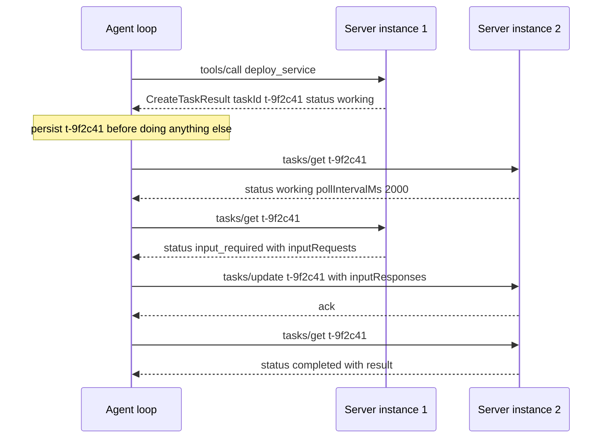

The `deploy_service` tool takes about eleven minutes on a good day. Your agent calls it,
the HTTP POST sits open, and somewhere around the ninety-second mark a load balancer
between you and the MCP server decides nobody is talking and drops the connection. The
agent sees a transport error, retries, and deploys again.

That is the old failure, and the spec authors name it plainly: blocking "ties up a
connection for the duration of the operation," and "many clients and transport
intermediaries impose timeouts that make this impractical beyond a few seconds."

The new failure is stranger. You upgrade the server to MCP `2026-07-28`, the agent calls
`deploy_service`, a response comes back in forty milliseconds, and the agent tells the
user the deploy is done. It is not done. It is running. The server handed back a receipt
and your tool handler read it as a result.

## The result shape your handler has no branch for

Under the Tasks extension, a server that decides a request will be long-running answers
with a `CreateTaskResult` instead of the result you asked for. The spec is precise about
the shape: the server returns "a `CreateTaskResult` (identified by `resultType: "task"`)
containing a `taskId`, initial status, TTL, and suggested polling interval," and "the
task is durably created before the response is sent."

It is flat — `Result & Task` in the schema, not a result with a task nested inside it —
so it arrives in exactly the position your `CallToolResult` used to occupy:

```json
{
  "resultType": "task",
  "taskId": "t-9f2c41",
  "status": "working",
  "createdAt": "2026-09-17T09:14:02Z",
  "lastUpdatedAt": "2026-09-17T09:14:02Z",
  "ttlMs": 3600000,
  "pollIntervalMs": 2000
}
```

No `content` key. No `isError`. If your executor does `result["content"][0]["text"]` and
appends it to the message list, it raises — and that is the lucky case. The unlucky case
is the executor that shrugs, stringifies whatever it got, and hands the model a JSON blob
that reads enough like success to keep the conversation moving.

## You opt in; the server decides

The asymmetry here is the part worth internalizing. "Task creation is server-directed:
the client advertises the extension and the server decides when a call should run as a
task." You do not ask for a task. You declare, on every request, that you can cope with
one:

```json
{
  "_meta": {
    "io.modelcontextprotocol/protocolVersion": "2026-07-28",
    "io.modelcontextprotocol/clientCapabilities": {
      "extensions": { "io.modelcontextprotocol/tasks": {} }
    }
  }
}
```

Servers must check that flag: "Never return a task to a client that did not declare
support." Which means the failure above only happens to clients that already claimed they
could handle it — and that a client which quietly stops sending that capability falls back
to blocking calls and rediscovers the ninety-second timeout.

The practical consequence for your agent loop: **branch on the result shape, not on the
tool name.** The same tool can answer synchronously for a small input and open a task for
a large one, on consecutive calls, with nothing in `tools/list` to warn you.

## The session is gone, which is why the handle matters

Tasks did not arrive in this shape by accident. `2026-07-28` deleted the plumbing that a
connection-scoped job would have hung from: "The `initialize`/`initialized` handshake is
removed," along with "the `Mcp-Session-Id` header and the protocol-level session that came
with it." There is "no negotiation handshake" at all now — every request carries its own
version and capabilities in `_meta`, and a server receiving a stale `Mcp-Session-Id`
should "ignore it, and do not mint or echo session IDs."

The payoff is that "any MCP request can land on any server instance, and the sticky
routing and shared session stores that horizontal deployments needed before are no longer
required at the protocol layer." Your poll and the call that started the task have no
reason to reach the same process:



Read along the left edge: the agent talks to two interchangeable instances over one
logical operation, and the only thing tying those five exchanges together is the string
`t-9f2c41`. The connection carries nothing. The handle carries everything.

Which is also why `tasks/list` was cut: it "is removed because it can't be scoped safely
without sessions." There is no call that answers *what did I start?* If your process dies
between receiving the `taskId` and writing it down, the deploy still runs, still consumes
its eleven minutes, and nothing in the protocol will ever hand it back to you. Persist
the ID before you log it, before you return it, before anything.

## Driving a task from the client side

The Python SDK is at 2.x and ships the stateless core, but the Tasks runtime is not in a
release yet — it is still an open pull request, `#3005`, "Add the SEP-2663 Tasks extension
(core)." So the driver below is hand-rolled over `httpx`. `store` is whatever durable
thing you already trust: a Postgres row, a Redis key, a file. The point is that it
survives the process.

```python
import asyncio
import itertools
import time
from datetime import datetime

import httpx

PROTOCOL = "2026-07-28"
TASKS = "io.modelcontextprotocol/tasks"
_ids = itertools.count(1)


def _meta() -> dict:
    # Capabilities ride on every request now; there is no handshake to carry
    # them. Drop the extensions map and the server is forbidden from handing
    # you a task, so every call silently goes back to blocking.
    return {
        "io.modelcontextprotocol/protocolVersion": PROTOCOL,
        "io.modelcontextprotocol/clientInfo": {"name": "deploy-agent", "version": "0.3.0"},
        "io.modelcontextprotocol/clientCapabilities": {"extensions": {TASKS: {}}},
    }


async def rpc(http: httpx.AsyncClient, url: str, method: str,
              params: dict, name: str | None = None) -> dict:
    headers = {"MCP-Protocol-Version": PROTOCOL, "Mcp-Method": method,
               # Required on every POST: the server chooses per request whether to
               # answer with a JSON object or an SSE stream, and a client MUST
               # support both. The SSE branch is omitted here for brevity.
               "Accept": "application/json, text/event-stream"}
    if name is not None:
        # Mirrored so proxies can route without parsing the body. The server
        # compares it against params["name"] and answers -32020 HeaderMismatch
        # on a mismatch. A name outside the header-safe ASCII set is carried as
        # =?base64?...?= instead, which the server decodes before comparing.
        headers["Mcp-Name"] = name
    body = {"jsonrpc": "2.0", "id": next(_ids), "method": method,
            "params": {**params, "_meta": _meta()}}
    response = await http.post(url, json=body, headers=headers, timeout=30.0)
    response.raise_for_status()
    message = response.json()
    if "error" in message:
        raise RuntimeError(message["error"])
    return message["result"]
```

The call site branches on `resultType` and nothing else:

```python
async def call_tool(http, url, tool: str, arguments: dict, store) -> dict:
    result = await rpc(http, url, "tools/call",
                       {"name": tool, "arguments": arguments}, name=tool)
    if result.get("resultType") != "task":
        return result  # ordinary CallToolResult; nothing to drive

    # Write the handle down first. tasks/list is gone: an unpersisted taskId
    # is work that runs to completion and can never be claimed.
    store.remember(result["taskId"], deadline=_deadline(result))
    return await drive(http, url, result["taskId"], store)


def _deadline(task: dict) -> float | None:
    ttl = task.get("ttlMs")  # null means unlimited
    if ttl is None:
        return None
    # The TTL runs from creation, not from this poll. Re-basing it on "now"
    # every pass would walk the deadline forward forever and keep polling a
    # task the server has already discarded.
    created = datetime.fromisoformat(task["createdAt"].replace("Z", "+00:00"))
    return created.timestamp() + ttl / 1000
```

And the loop itself re-reads its own pacing on every pass, because both `ttlMs` and
`pollIntervalMs` "MAY change over the lifetime of a task":

```python
async def drive(http, url, task_id: str, store) -> dict:
    deadline = store.deadline(task_id)
    while True:
        if deadline is not None and time.time() > deadline:
            # The server "may discard the task after the TTL elapses" -- past
            # this point tasks/get is not guaranteed to find anything.
            store.forget(task_id)
            raise TimeoutError(f"task {task_id} outlived its ttlMs")

        task = await rpc(http, url, "tasks/get", {"taskId": task_id})
        status = task["status"]

        if status == "completed":
            store.forget(task_id)
            return task["result"]  # the CallToolResult you would have got
        if status == "failed":
            store.forget(task_id)
            raise RuntimeError(task["error"])
        if status == "cancelled":
            store.forget(task_id)
            raise asyncio.CancelledError(task.get("statusMessage", ""))
        if status == "input_required":
            await rpc(http, url, "tasks/update",
                      {"taskId": task_id,
                       "inputResponses": await answer(task["inputRequests"])})

        deadline = _deadline(task)
        store.extend(task_id, deadline)
        await asyncio.sleep(task.get("pollIntervalMs", 1000) / 1000)


async def answer(input_requests: dict) -> dict:
    # One response per outstanding key; the spec requires each key to match a
    # currently-outstanding inputRequest. Wire this to your elicitation UI.
    raise NotImplementedError
```

`completed`, `failed` and `cancelled` are terminal — "once reached, the task's state does
not change" — so those three branches are the only exits, and everything else loops.

## Mid-flight input arrives as a poll result

The `input_required` branch is easy to skim past and it is the most interesting state in
the machine. When a task needs a human — an approval gate, a confirmation — it "moves to
`input_required` and surfaces the request," and the client answers "via `tasks/update` —
no second connection or unsolicited server-to-client messages required."

That inverts something most agent frameworks assume, and the inversion is not the Tasks
extension's doing — it is core to `2026-07-28`. Through `2025-11-25` a server could push a
request down an open SSE stream at a moment of its choosing. Under MRTR (SEP-2322),
"server-to-client interactions (sampling, elicitation, list-roots) are embedded as input
requests inside an `InputRequiredResult` ... not delivered as separate requests on this or
any other stream." Inside a task, you collect them from `tasks/get` — a field in a
response you asked for, whenever you happen to ask. A human approval that sits untouched
for two hours costs you one open connection: zero.

## What it costs you

Cancellation is a request, not a command. "The server acknowledges the intent but is not
obligated to stop the work," and the task "may still reach a non-`cancelled` terminal
status" — so a `tasks/cancel` followed by a `completed` is correct behavior, not a bug,
and your loop has to treat it as such.

Polling is the default, and for an eleven-minute deploy at a two-second interval that is
330 round-trips to learn nothing. Servers may push `notifications/tasks` instead, which
clients opt into through `subscriptions/listen`, and each notification "carries the full
task state, eliminating the need for an extra `tasks/get` round-trip." That is worth
wiring up — but it is optional on the server side, so the polling path stays as your
floor either way.

And the migration is not free. Tasks first shipped as an experimental *core* feature in
`2025-11-25`; it is now an optional extension with a different lifecycle, and "anyone who
shipped against the `2025-11-25` experimental Tasks API will need to migrate to the new
lifecycle." The
underlying protocol change is "wire-incompatible in both directions," which is why
`2025-11-25` and earlier are now formally called *legacy*, and a dual-era server may
serve both eras concurrently on one endpoint.

## Where this leaves your agent loop

Go find the function in your codebase that turns a `tools/call` response into a message,
and give it a `resultType` branch today, before any server you talk to starts opening
tasks on you. It is a five-line change while the failure is hypothetical and an incident
review once it is not.

Then decide where task IDs live. Not in the conversation state, not in a dict on the
agent object — somewhere that outlives a pod restart. The protocol has deliberately
stopped keeping track of your in-flight work, and it has no call left that would let it
start again.

## Further reading

- [MCP Tasks — asynchronous task execution for long-running operations](https://modelcontextprotocol.io/specification/2026-07-28/basic/utilities/tasks)
- [The 2026-07-28 MCP Specification Release Candidate](https://blog.modelcontextprotocol.io/posts/2026-07-28-release-candidate/)
- [MCP 2026-07-28: Versioning and Compatibility](https://modelcontextprotocol.io/specification/2026-07-28/basic/versioning)
- [MCP 2026-07-28: Streamable HTTP transport](https://modelcontextprotocol.io/specification/2026-07-28/basic/transports/streamable-http)
- [`modelcontextprotocol/ext-tasks` — the Tasks extension schema](https://github.com/modelcontextprotocol/ext-tasks)
- [MCP 2025-11-25 changelog (where Tasks first landed, experimentally)](https://modelcontextprotocol.io/specification/2025-11-25/changelog)
- [MCP July 2026 update: stateless core, extensions, and Tasks](https://newsletter.victordibia.com/p/mcp-july-2026-update-stateless-core)
- [python-sdk #3005 — Add the SEP-2663 Tasks extension (core)](https://github.com/modelcontextprotocol/python-sdk/pull/3005)
