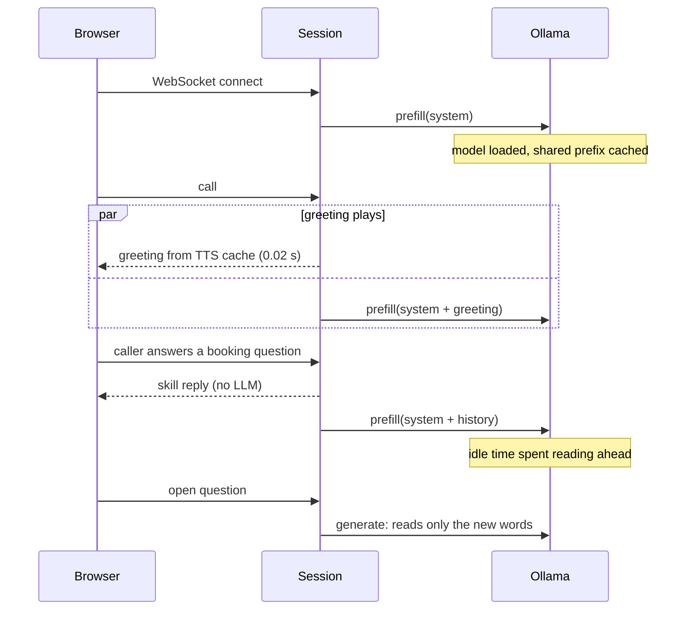

The caller says "cho tôi đặt bàn bốn người tối mai lúc sáu giờ" — a table for four, tomorrow at six — and stops talking. On a laptop with no GPU, a 1.7B model would need seconds just to re-read a 700-token prompt before saying a word. A phone caller hears that silence as a dropped line.

**vi-voicebot** is a restaurant receptionist that answers in Vietnamese and runs entirely on one CPU: Silero VAD, a 30M-parameter Zipformer ASR, an intent state machine, a small Ollama model, and Piper TTS, all local. On an Intel Core Ultra 7 265H with 32 GB RAM and no GPU, booking turns start speaking 0.02–0.30 s after the caller stops. The trick isn't a faster model. It's two rules: **the LLM only runs when nothing cheaper can decide**, and **when it runs, it must never re-read what it has already seen**.

The whole system: speech in along the top row, the reply back along the bottom.


## The LLM is the slowest and least trustworthy part, so route around it

On this machine Ollama reads prompts at 109 tok/s with default threads (170 tok/s tuned) and generates at 23–34 tok/s. An LLM intent classifier costs 0.6–2 s per turn. That's fine for "which dish is best?" and terrible for "yes, that's right."

So every caller turn walks a ladder, cheapest rung first:

1. **A skill that is mid-task claims the turn.** If the booking skill just asked for a time and the text parses as a time, that's the answer. 0 ms.
2. **A half-finished skill in another legal state claims it** — the caller asked about the menu mid-booking, then said "bảy giờ" (seven o'clock). Back to the booking.
3. **Keyword regexes match exactly one legal state.** Several matches fall through to the LLM rather than guessing.
4. **The bot's last line ended in "?"** and we're past the opening: the caller is answering, so stay.
5. Only then, **ask the LLM** to pick a label.

In a profiled nine-turn booking call, all nine turns were decided by rules or skills. The classifier is for open utterances like "món nào ngon nhất?".

## Code owns anything that has to be right

The second half of the split matters more than the latency. Bookings, availability, change and cancel, menu prices and human handoff are deterministic code over SQLite and a JSON menu. The LLM never confirms a table and never quotes a price.

That rule was learned the obvious way: before the menu skill existed, the model cheerfully invented a price for a vegetarian dish. Tool calling was rejected on purpose — small models are unreliable tool callers.

The booking skill does the boring things a model would get creatively wrong. When the slot is full it offers the two nearest free times on a 30-minute grid. `book()` re-checks availability inside a lock and transaction before inserting, so a table taken between "still free" and "yes, confirm" gets a new question instead of a double booking. Two turns in a row with no progress hand the call to a human callback.

## Prompt-cache discipline on a slow CPU

When the LLM does run, latency is dominated by how much of the prompt Ollama has to re-read. A 700-token prompt from scratch costs 4–7 s here; the 20 new tokens of a turn cost 0.1–0.3 s. llama.cpp reuses the longest common prefix of the previous request in the slot, so the whole game is keeping that prefix byte-identical:

- **The system prompt is fixed for the entire call, with the timestamp as its last line.** Everything above the clock — rules, topic labels, restaurant facts — is shared by every call, so it's prefilled once at startup.
- **History is append-only, and the assistant turn is stored as the exact raw text the model produced**, not the cleaned sentences the TTS spoke. Fillers never enter history.
- **History is trimmed rarely and in one big step** (24 messages down to 12), because every trim invalidates the prefix once.

The subtle one was Qwen3. With thinking off, it still emits an empty `<think>` block at the start of every reply. Ollama's `/api/chat` re-rendered past replies *without* that block, so the last reply never matched the cache and was re-read every turn — about a second of waste. The fix is to bypass templating with `/api/generate` in raw mode and build ChatML exactly as the model generated it:

```python
import requests

OLLAMA = "http://localhost:11434"

def qwen_prompt(messages):
    """ChatML byte-identical to what Qwen3 generated with thinking off,
    so every past turn matches llama.cpp's cached prefix."""
    out = ""
    for m in messages:
        think = "<think>\n\n</think>\n\n" if m["role"] == "assistant" else ""
        out += f"<|im_start|>{m['role']}\n{think}{m['content']}<|im_end|>\n"
    return out + "<|im_start|>assistant\n<think>\n\n</think>\n\n"

def llm_request(model, messages, stream=True, **options):
    opts = {"temperature": 0.6, "num_predict": 160,
            "num_ctx": 2048,   # the service default here was 32k -> 4.95 GB
            "num_thread": 6,   # performance cores only
            **options}
    body = {"model": model, "stream": stream, "keep_alive": "30m",
            "options": opts, "raw": True,       # no server-side templating
            "prompt": qwen_prompt(messages)}
    r = requests.post(f"{OLLAMA}/api/generate", json=body,
                      stream=stream, timeout=120)
    r.raise_for_status()
    return r

def prefill(model, system, history=()):
    """Warm the KV cache while the caller is still talking."""
    msgs = [{"role": "system", "content": system}, *history]
    llm_request(model, msgs, stream=False, num_predict=1)
```

`prefill` is where the time comes back: skill turns leave Ollama idle while the caller speaks, so the bot reads ahead. The timeline across the browser, the session and Ollama:



By the time a question reaches the model, everything except the caller's last sentence is already in the KV cache. Measured on the first LLM turn after a model switch, this took gemma3:1b from 13.8 s to 1.7 s, and 1.05 s on the next call.

## Small findings that cost real time to find

- **Ollama's JSON-schema output with a bare root `{"enum": [...]}` returned wrong intent labels** — 0/10. Wrapping the same enum in an object, `{"type": "object", "properties": {"intent": {"enum": [...]}}}`, got 10/10.
- **Putting every state's instructions in the system prompt made replies ~0.7 s faster and dropped intent accuracy from 10/10 to 3/10.** A state's prompt is now injected into the user turn once, the first time the LLM answers in that state.
- **Fewer threads were faster.** Six threads, one per performance core, ran 1.5× faster than the default; 14 threads made generation about 10× slower (2.4 tok/s).
- **The Ollama service on this machine set a 32k context**, putting qwen3:1.7b at 4.95 GB. With `num_ctx` 2048 — plenty for a phone call — it's around 1.6 GB.

## Vietnamese speech is a text problem first

ASR emits number words, parsers want digits, and TTS voices misread digits. So numbers cross the pipeline twice. Inbound, "bốn người lúc bảy giờ rưỡi" becomes "4 người lúc 7 giờ rưỡi" — but only next to a counting context, so "năm nay" (this year) keeps its "năm". Outbound, a `speakable()` pass rewrites every number the Vietnamese way: 21 as "hai mươi mốt", 105 as "một trăm linh năm", phone numbers digit by digit, 19:05, 50k. Loanwords get respelled from a staff-editable file (menu → "mê nu"). The UI shows digits; the voice reads words.

ASR tone slips are handled without a bigger model. Menu matching tries exact diacritics first, then **accent-folded** text (lowercase, NFD, strip marks, đ→d), so "lầu cá" still finds lẩu cá. Yes/no uses a closest-phrase match on folded text, so "đúng dồi" counts as "đúng rồi". And every menu name becomes an ASR hotword: decoding went from 42 ms to 54 ms per utterance and "giá lổ cá" became "giá lẩu cá" with no other output changes on the test set.

## Latency you get for free

- **Pre-synthesized fixed sentences.** About 19 lines — greeting, booking questions, goodbye — are synthesized at startup. The greeting starts in 0.02 s.
- **Early endpointing.** The VAD fires after 0.3 s of silence. If the text already completes the pending question — a full phone number, a clear "yes" — the turn commits then; otherwise it waits for 0.6 s.
- **Sentence-by-sentence TTS** on the LLM stream, so a long answer starts speaking after its first clause.
- **A cached filler** ("Dạ, em xem ngay ạ.") if no audio has started after 3 s.
- **Barge-in** after 300 ms of caller speech, relying on the browser's echo cancellation; history keeps only what was actually spoken.

The Docker stack fits a 1.4 GB memory budget with qwen3:0.6b, a q8 KV cache, `num_batch` 128 and `LLAMA_ARG_CACHE_RAM=0` (llama-server otherwise reserves up to 8 GiB for its prompt cache). Measured peak: 1,082–1,121 MiB. Profiling also caught a TTS cache capped by entry count that could grow toward ~200 MB; it's capped by bytes now.

One observability gotcha: each call is a Langfuse session and each turn a trace, but every turn landed in one giant trace. FastAPI emits an OpenTelemetry span `WS /ws` for the whole connection, and `asyncio.create_task` copies the current context by default. Passing `context=contextvars.Context()` to each turn task fixed it.

## Where it falls short

- **The default ASR model is CC BY-NC-ND** — non-commercial. It has to be replaced before anyone sells this.
- **Browser only.** There's no phone line yet.
- **Small LLMs slip in Vietnamese**, qwen3:0.6b especially. "Mấy giờ rồi?" (what time is it?) gets the opening hours.
- **Concurrency beyond one call is estimated, not load-tested**, and the memory plateau over long uptime isn't verified.

If you're building a voice agent on modest hardware, start by listing what must be correct and write that as code; then make the model's prompt append-only and spend every idle moment prefilling it. The model you can afford gets much better once it only answers the questions nothing else can.

## Further reading

- [Ollama API reference](https://github.com/ollama/ollama/blob/main/docs/api.md) — `raw`, `format` and `keep_alive` on `/api/generate`
- [llama.cpp server README](https://github.com/ggml-org/llama.cpp/blob/master/tools/server/README.md) — `cache_prompt` prefix reuse and `--cache-ram`
- [sherpa-onnx hotwords](https://k2-fsa.github.io/sherpa/onnx/hotwords/index.html) — contextual biasing with `modified_beam_search`
- [asyncio.create_task](https://docs.python.org/3/library/asyncio-task.html) — the `context` argument and default context copying
