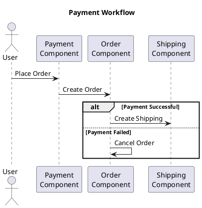

---
author:
    name: "Thinh Dang"
    avatar: "/assets/images/avatar.png"
    bio: "Experienced Fintech Software Engineer Driving High-Performance Solutions"
    location: "Viet Nam"
    email: "thinhdang206@gmail.com"
    links:
        -   label: "Linkedin"
            icon: "fab fa-fw fa-linkedin"
            url: "https://www.linkedin.com/in/thinh-dang/"
toc: true
toc_sticky: true
header:
    overlay_image: /assets/images/subinterpreter/banner.jpeg
    overlay_filter: 0.5
    teaser: /assets/images/subinterpreter/banner.jpeg
title: "Python 3.12 Subinterpreters: A New Era of Concurrency"
tags:
    - Python

---


# Building a Payment System with Temporal Workflow: A SAGA Pattern Implementation

In this blog post, we will delve into the realm of distributed systems and workflows by building a payment system using Temporal Workflow. We will leverage the SAGA pattern, a design pattern that helps manage data consistency across multiple, distributed services. Our payment system will comprise three components: payment, order, and shipping, working in unison to create a seamless user experience. We will walk you through the process of setting up your development environment using Docker Compose, building the payment system, implementing the workflow in Python using Temporal Workflow, and visualizing it. Furthermore, we will guide you on how to test and debug your system. By the end of this post, you will have a deep understanding of Temporal Workflow, the SAGA pattern, and how to use them to build reliable, scalable systems.

## Introduction

The world of software development is always evolving, with new technologies and patterns emerging to solve complex problems. One such technology that has gained a lot of attention recently is Temporal Workflow. In this blog post, we'll delve into the world of Temporal Workflow, explore its benefits, and see how it can be used to build a robust payment system.

### Temporal Workflow: A Brief Overview

Temporal Workflow is a programming model that provides a unique way of writing distributed, reliable, and scalable applications. It's not just a regular function execution; it's a unit of execution that provides stunning improvements over regular function execution.

At the heart of Temporal Workflow is the concept of a Workflow Execution, which is a reentrant process that is resumable, recoverable, and reactive. This means that a Temporal Workflow Execution executes your application code exactly once and to completion, regardless of how long your code executes or the presence of arbitrary load and failures.

### The Benefits of Temporal Workflow

Temporal Workflow offers numerous benefits that make it an attractive choice for building complex distributed systems. Some of the key benefits include:

1. **Reliability**: Temporal Workflow mitigates failure on a platform level, guaranteeing correctness on an application level. It maintains the state of your workflow, even through server outages and errors.
2. **Scalability**: Temporal Workflow Executions consume few compute resources. If a Workflow Execution is suspended, such as when it is in a waiting state, the Workflow Execution consumes no compute resources at all.
3. **Visibility**: Temporal Workflow gives full visibility in the state of your workflow and code execution.
4. **Developer Experience**: Temporal Workflow provides a great developer experience, allowing you to write your application code using the full power of your chosen programming language, while the Temporal Platform handles the durability, reliability, and scalability of the application.

In the following sections, we'll explore how we can leverage these benefits to build a payment system using Temporal Workflow.

### Building a Payment System using Temporal Workflow

A payment system is a crucial component of any e-commerce platform. It is responsible for settling financial transactions through the transfer of monetary value. Building a robust, scalable, and reliable payment system can be a complex task, especially when it involves multiple components and services.

This is where Temporal Workflow comes in. It can help manage the business logic of the payment process, providing features like fault tolerance, scalability, maintainability, and observability. By using Temporal Workflow, we can ensure that our payment system can handle the complexities of processing payments, managing subscriptions, and dealing with failures.

In the next blog post, we will dive deeper into how we can use Temporal Workflow to build a payment system. We will cover how to set up Temporal Workflow using Docker Compose, create a workflow for handling payments, and how to implement the SAGA pattern to ensure data consistency across our services.

Stay tuned for an exciting journey as we explore the power of Temporal Workflow!


## Understanding Temporal Workflow

Temporal Workflow is a powerful tool for building reliable, scalable, and maintainable distributed systems. Let's dive deeper into what Temporal Workflow is, its benefits, use cases, architecture, SDKs, components, and features.

### What is Temporal Workflow?

Temporal Workflow is a core abstraction of the Temporal platform, serving as its unit of execution, reliability, and scalability. It is a reentrant process that is resumable, recoverable, and reactive. This means your application code executes exactly once and to completion, no matter how long your code executes or the presence of arbitrary load and failures.

In simpler terms, a Temporal Workflow is a set of reliable, durable function executions. These Workflow Executions orchestrate the execution of Activities, which execute a single, well-defined action, such as calling another service, transcoding a media file, or sending an email message.

### Benefits of Temporal Workflow

Temporal Workflow offers a range of benefits that make it a compelling choice for building complex distributed systems. Some of the key benefits include:

1. **Reliability**: Temporal Workflow mitigates failure on a platform level, guaranteeing correctness on an application level. It maintains the state of your workflow, even through server outages and errors.
2. **Scalability**: A Temporal Workflow Execution consumes few compute resources. If a Workflow Execution is suspended, such as when it is in a waiting state, the Workflow Execution consumes no compute resources at all.
3. **Visibility**: Temporal Workflow gives full visibility in the state of your workflow and code execution.
4. **Developer Experience**: Temporal Workflow provides a great developer experience, allowing you to write your application code using the full power of your chosen programming language, while the Temporal Platform handles the durability, reliability, and scalability of the application.

### Use Cases of Temporal Workflow

Temporal Workflow is used in a variety of scenarios, particularly where processes can fail, such as when calling external services, and the Workflow needs to maintain the state and allow for retries. For example, Temporal Workflow can be used for sending reminder emails or for creating durable and reliable workflows.

### Temporal Workflow Architecture

The Temporal Platform consists of a Temporal Cluster and Worker Processes. These components create a runtime for Workflow Executions. A Temporal Application is a set of Temporal Workflow Executions. Each Temporal Workflow Execution has exclusive access to its local state, executes concurrently to all other Workflow Executions, and communicates with other Workflow Executions and the environment via message passing.

### Temporal Workflow SDKs

Temporal offers SDKs for various languages including Go, Java, Python, TypeScript, and now .NET with a new alpha release. These SDKs are used to define Temporal Workflows.

### Temporal Workflow Components

Temporal Workflow Components include:

1. **Workflow**: A workflow is a set of reliable, durable function executions. 
2. **Activities**: Activities represent a single, well-defined action such as calling another service, transcoding a media file, or sending an email message.
3. **Worker**: A Worker is responsible for executing pieces of Workflow and Activity code.
4. **Temporal Server**: Temporal Server tracks the progress of your Workflow function execution.

### Temporal Workflow Features

Temporal Workflow features include full visibility in the state of your workflow and code execution, maintaining the state of your workflow, even through server outages and errors, enabling you to time out and retry Activity code using options that exist outside your business logic, and allowing for 'live debugging' of your business logic while the Workflow is running.

In the next section, we will discuss how Temporal Workflow can be used to build a robust payment system.

## Understanding the SAGA Pattern 

The SAGA Pattern is a key design pattern that can be used in the context of Temporal Workflow. It is especially useful in building complex distributed systems like a payment system. In this section, we will explore the SAGA Pattern, its benefits, how it can be implemented in Temporal Workflow, its use cases, limitations, and best practices.

### What is the SAGA Pattern?

The SAGA Pattern is a design pattern for managing data consistency across multiple, distributed services. If you have a series of operations that span more than one service and must be completed as a unit, and some operations must be undone if the entire transaction fails to complete, then the SAGA Pattern can ensure you maintain a consistent state in the event of failure.

In simpler terms, the SAGA Pattern is a sequence of local transactions. Each local transaction updates data within a single service and publishes an event to trigger the next local transaction in the sequence. If a local transaction fails because it violates a business rule, then the SAGA executes compensating transactions to undo the impact of the preceding local transactions.

### Benefits of Using the SAGA Pattern

The SAGA Pattern offers several benefits:

1. **Data Consistency**: The SAGA Pattern helps manage data consistency across distributed systems. It's useful when you have a set of operations that need to be executed in order, and if any operation fails, the previously executed operations need to be rolled back.
2. **Failure Management**: The SAGA Pattern is particularly useful for handling failures in a distributed system. If any operation in the sequence fails, the SAGA Pattern ensures that compensating transactions are executed to maintain data consistency.
3. **Transaction Management**: The SAGA Pattern provides transaction-like guarantees for a sequence of operations amid the chaos of distributed systems.

### Implementing the SAGA Pattern in Temporal Workflow

In a Temporal Workflow, you implement the SAGA Pattern by defining the behavior for 'going backwards' or compensating for a previous step in case of failure, and saving the state to know where to recover from in the event of a failure. This can be done using the RetryOptions and Saga classes. RetryOptions allows you to set the retry policy for the steps, and the Saga class helps you manage the compensations for each step. The compensations are activities that need to be executed to revert a previously completed step in case of a failure in a subsequent step.

### Use Cases of the SAGA Pattern in Temporal Workflow

The SAGA Pattern is useful in scenarios where you have a set of operations that need to be completed as a unit. For example, checking inventory, charging a user's credit card, and then fulfilling the order, or managing a supply chain. Other examples include use cases where multiple operations need to be executed successfully or none of them should be, like booking a trip with an airfare and hotel.

### Limitations of the SAGA Pattern in Temporal Workflow

While the SAGA Pattern provides several benefits, it also has some limitations in the context of Temporal Workflow. Temporal-specific configurations or actions might prevent your compensations from executing as you would like: if you set timeouts or retries on Workflows, your compensations might not get a chance to run before your Workflow times out. Additionally, terminate and reset will not allow Workflow code to execute any 'finally' or 'defer' statements.

### Best Practices of Using the SAGA Pattern in Temporal Workflow

When implementing the SAGA Pattern in Temporal, it's important to ensure each Temporal Activity is idempotent. This is because Temporal does all the heavy lifting of retrying and keeping track of your overall progress. To ensure idempotency, you can use a distinct identifier, called an idempotency key, to uniquely identify a particular transaction and ensure the operation occurs effectively once. Another best practice is to only implement the SAGA Pattern when necessary, as it does add complexity to your code.

In the next section, we will discuss how to set up Temporal Workflow using Docker Compose.

## Setting up the Environment

In this section, we will walk through the process of setting up a development environment using Docker Compose for starting our application and Temporal Workflow. Docker Compose makes it easier to configure and run applications composed of multiple Docker containers. It provides a way to spin up an entire stack of services needed by an application with a single command.

### Installing Docker and Docker Compose

Before we begin, we need to ensure that Docker and Docker Compose are installed on our system. Docker Compose is included as part of the Docker for Windows and Docker for Mac installations. For Linux systems, Docker Compose can be downloaded from the Docker Compose GitHub repository.

### Setting up Temporal Workflow with Docker Compose

Temporal provides a docker-compose repository that contains Docker Compose configurations for running Temporal with various databases and other options. To set up Temporal Workflow with Docker Compose, we need to clone the Temporal docker-compose repository and run the 'docker-compose up' command.

The steps are as follows:

1. Clone the Temporal docker-compose repository:

```bash
git clone https://github.com/temporalio/docker-compose.git
```

2. Navigate to the root of the cloned repository:

```bash
cd docker-compose
```

3. Run the `docker-compose up` command:

```bash
docker-compose up
```

This command starts a local instance of the Temporal Server using the default configuration file.

### Accessing Temporal Workflow

Once the Temporal Server is running, we can access it using the following endpoints:

- Temporal Web UI: `http://localhost:8080`
- Temporal Server for Temporal Clients and Workers: `127.0.0.1:7233`

### Conclusion

Setting up a development environment using Docker Compose for Temporal Workflow is straightforward. With a few commands, we can have a fully functional Temporal Server running on our local machine. This setup is ideal for development and testing purposes.

In the next section, we will delve into the design and implementation of our payment system using Temporal Workflow.

## Building the Payment System 

Now that we have our environment set up, let's dive into building our payment system. The system we'll create will have three main components: payment, order, and shipping. These components will interact with each other in a specific sequence to process an order. If any step in the sequence fails, the system will roll back the previous steps to ensure data consistency and prevent any unwanted side effects.

### Overview of the Payment System

Before we start coding, let's first discuss what each component does in our system:

1. **Payment**: This component is responsible for processing the payment for an order. It interacts with a payment gateway to charge the customer's credit card.
2. **Order**: This component manages the order details. It creates an order when a customer places one and cancels it if the payment fails.
3. **Shipping**: This component takes care of shipping the order. It creates a shipping order if the payment is successful. If the payment fails, no shipping order is created.

The interaction between these components follows the SAGA Pattern. When a customer places an order, it triggers the payment process. If the payment is successful, the shipping process starts. If the payment fails, the order is cancelled.

### Implementing the Workflow using Temporal Workflow

Let's start implementing this workflow using Temporal Workflow. We will use Python for our implementation, but you can use any language supported by Temporal.

First, we need to define our workflow interface. This interface defines the contract for our workflow. The `@workflow_interface` decorator is used to indicate that this is a workflow interface.

```python
from temporal.workflow import workflow_interface, Workflow

@workflow_interface
class PaymentWorkflow:
    @Workflow.method
    async def process_payment(self, order_id: str) -> None:
        ...
```

In the `PaymentWorkflow` interface, we define a single method `process_payment` that takes an order ID as input. This method will be implemented in our workflow class.

Next, we define our workflow class that implements the `PaymentWorkflow` interface. This class contains the business logic for processing a payment.

```python
from temporal.workflow import workflow_method, Workflow

class PaymentWorkflowImpl(PaymentWorkflow):
    @workflow_method
    async def process_payment(self, order_id: str) -> None:
        # Business logic for processing payment
        ...
```

In the `process_payment` method, we will implement the logic for processing a payment, creating an order, and managing shipping. We will use the SAGA Pattern to ensure that if any step in the sequence fails, the system will roll back the previous steps.

In the next section, we will discuss how to implement the SAGA Pattern in our workflow.

### Implementing the SAGA Pattern in the Workflow

The SAGA Pattern can be implemented in Temporal Workflow using the `saga` module. This module provides a `Saga` class that allows us to add compensating actions for each step in our workflow.

Let's modify our `process_payment` method to use the `Saga` class:

```python
from temporal.workflow import workflow_method, Workflow, saga
from temporal.activity_method import activity_method

class PaymentWorkflowImpl(PaymentWorkflow):
    @workflow_method
    async def process_payment(self, order_id: str) -> None:
        # Create a Saga object
        s = saga.Saga()
        
        # Step 1: Process payment
        payment_id = await PaymentActivity.process_payment(order_id)
        
        # Add compensating action for step 1
        s.add_compensation(PaymentActivity.refund_payment, payment_id)
        
        # Step 2: Create order
        order_id = await OrderActivity.create_order(order_id)
        
        # Add compensating action for step 2
        s.add_compensation(OrderActivity.cancel_order, order_id)
        
        # Step 3: Create shipping order
        shipping_id = await ShippingActivity.create_shipping(order_id)
        
        # No compensating action is needed for step 3

        # Close the saga to run all compensating actions in case of a failure
        s.close()
```

In this code, we create a `Saga` object and use its `add_compensation` method to add compensating actions for each step in our workflow. If any step fails, all added compensations will be executed.

### Conclusion

In this section, we've walked through the process of building a payment system using Temporal Workflow. We've discussed the three main components of the system: payment, order, and shipping, and their interactions. We've also seen how to implement the SAGA Pattern in our workflow to handle failures and ensure data consistency.

In the following section, we will illustrate the workflow using a diagram and discuss how to run and test our system.

## Implementing the Workflow

Now that we have a clear understanding of our payment system's components and the SAGA pattern, let's dive deeper into the implementation of our workflow. We'll be using Python for our implementation, leveraging the Python SDK provided by Temporal.

### Defining the Activities

Before we start with our workflow, we need to define the activities that our workflow will orchestrate. In our case, these activities will correspond to the operations performed by the payment, order, and shipping components of our system.

Let's define these activities using Temporal's `@activity_method` decorator:

```python
from temporal.activity_method import activity_method
from temporal.activity import Activity

class PaymentActivity:
    @activity_method(task_queue="payment-task-queue", schedule_to_close_timeout=timedelta(minutes=5))
    async def process_payment(self, order_id: str) -> str:
        # Business logic for processing payment
        ...

    @activity_method(task_queue="payment-task-queue", schedule_to_close_timeout=timedelta(minutes=5))
    async def refund_payment(self, payment_id: str) -> None:
        # Business logic for refunding payment
        ...

class OrderActivity:
    @activity_method(task_queue="order-task-queue", schedule_to_close_timeout=timedelta(minutes=5))
    async def create_order(self, order_id: str) -> str:
        # Business logic for creating order
        ...

    @activity_method(task_queue="order-task-queue", schedule_to_close_timeout=timedelta(minutes=5))
    async def cancel_order(self, order_id: str) -> None:
        # Business logic for canceling order
        ...

class ShippingActivity:
    @activity_method(task_queue="shipping-task-queue", schedule_to_close_timeout=timedelta(minutes=5))
    async def create_shipping(self, order_id: str) -> str:
        # Business logic for creating shipping
        ...
```

Each activity is a method decorated with the `@activity_method` decorator, which registers the method as an activity with Temporal. We specify a task queue for each activity and a timeout to ensure that our activities don't run indefinitely.

### Implementing the Workflow

With our activities defined, we can now implement our workflow. Our workflow will orchestrate these activities in a sequence, adhering to the SAGA pattern.

Let's define our workflow using Temporal's `@workflow_method` decorator:

```python
from temporal.workflow import Workflow, workflow_method, saga
from activities import PaymentActivity, OrderActivity, ShippingActivity

class PaymentWorkflowImpl(PaymentWorkflow):
    @workflow_method
    async def process_payment(self, order_id: str) -> None:
        # Create a Saga object
        s = saga.Saga()

        # Step 1: Process payment
        payment_id = await PaymentActivity.process_payment(order_id)

        # Add compensating action for step 1
        s.add_compensation(PaymentActivity.refund_payment, payment_id)

        # Step 2: Create order
        order_id = await OrderActivity.create_order(order_id)

        # Add compensating action for step 2
        s.add_compensation(OrderActivity.cancel_order, order_id)

        # Step 3: Create shipping order
        shipping_id = await ShippingActivity.create_shipping(order_id)

        # No compensating action is needed for step 3

        # Close the saga to run all compensating actions in case of a failure
        s.close()
```

In this code, we create a `Saga` object and use its `add_compensation` method to add compensating actions for each step in our workflow. If any step fails, all added compensations will be executed.

### Conclusion

In this section, we've walked through the process of implementing a workflow for our payment system using Temporal Workflow. We've seen how to define activities for the different components of our system and how to orchestrate these activities in a workflow. We've also seen how to implement the SAGA pattern in our workflow to handle failures and ensure data consistency.

In the following section, we will illustrate this workflow using a diagram and discuss how to run and test our system.

## Visualizing the Workflow

A picture is worth a thousand words, and this is especially true when trying to understand complex systems and workflows. In this section, we'll create a diagram to visualize our payment system and the workflow we've implemented using Temporal Workflow. This will provide a clear, visual representation of how our payment, order, and shipping components interact with each other and how the SAGA pattern is used to handle failures and ensure data consistency.

### Drawing the Workflow Diagram

There are many tools available for drawing diagrams, such as draw.io, Lucidchart, and PlantUML. For this example, we'll use PlantUML because it allows us to create diagrams using a simple and intuitive language.

Here's a PlantUML diagram that represents our payment workflow:



This diagram shows the sequence of events when a user places an order:

1. The user places an order, which triggers the payment process in the Payment Component.
2. The Payment Component then creates an order in the Order Component.
3. If the payment is successful, the Order Component triggers the Shipping Component to create a shipping order.
4. If the payment fails, the Order Component cancels the order.

The alternate flows in the diagram represent the SAGA pattern. If the payment fails, the system rolls back the previous steps to ensure data consistency and prevent any unwanted side effects.

### Conclusion

Visualizing our workflow with a diagram provides a clear, visual representation of our payment system and the interactions between its components. It also helps us understand how the SAGA pattern is used to handle failures and ensure data consistency. This understanding is crucial when building complex distributed systems like our payment system.

In the next section, we will discuss how to run and test our system.

## Testing and Debugging 

After implementing our workflow and visualizing it with a diagram, the next step is to test and debug our system. Testing is a critical part of the development process. It helps us ensure that our system works as expected and helps us identify and fix any issues or bugs. In this section, we will discuss how to test and debug our payment system and the workflow we've implemented using Temporal Workflow.

### Testing the Payment System

Testing our payment system involves simulating the sequence of events that occur when a user places an order. We need to ensure that our system correctly processes payments, creates orders, and manages shipping. If the payment fails, our system should cancel the order, as per the SAGA pattern.

Temporal provides a testing framework that we can use to write unit tests for our workflows and activities. This framework provides a `TestWorkflowEnvironment` class that we can use to simulate the execution of our workflows and activities.

Here's an example of how we can write a unit test for our `process_payment` workflow:

```python
from temporal.testing import TestWorkflowEnvironment
from workflows import PaymentWorkflowImpl

def test_process_payment():
    # Create a TestWorkflowEnvironment
    test_env = TestWorkflowEnvironment()

    # Register our workflow implementation with the test environment
    test_env.register_workflow_implementation_type(PaymentWorkflowImpl)

    # Initialize our workflow
    workflow = test_env.new_workflow_stub(PaymentWorkflow)

    # Execute the workflow
    workflow.process_payment("order123")

    # Assert that the workflow completed successfully
    assert test_env.is_workflow_completed

    # Assert that no failures were encountered
    assert test_env.workflow_execution_errors == []
```

In this test, we create a `TestWorkflowEnvironment`, register our workflow implementation, and then initialize and execute our workflow. We then assert that the workflow completed successfully and that no failures were encountered.

### Debugging the Payment System

Even with thorough testing, issues or bugs can still slip through. When this happens, we need to debug our system to identify and fix these issues. 

Temporal provides several tools and features that can help us debug our system. One of these is the Temporal Web UI, which we can use to inspect the state of our workflows. The Web UI provides a visual representation of our workflows, showing the progress of each workflow execution and any errors or failures that occurred.

Another useful feature for debugging is the ability to query the state of a running workflow. We can add query methods to our workflows that we can call to get information about the workflow's state.

Finally, Temporal also provides logging capabilities that we can use to log information about the execution of our workflows and activities. These logs can be invaluable when trying to understand what went wrong in a failed workflow execution.

### Conclusion

Testing and debugging are crucial steps in the development process. They help us ensure that our system works as expected and allow us to identify and fix any issues or bugs. By leveraging the testing and debugging tools and features provided by Temporal, we can ensure that our payment system is robust, reliable, and ready for production.

In the next blog post, we will discuss how to deploy our payment system, and how to monitor and maintain it in production. Stay tuned!

## Conclusion 

We've come a long way in this blog post. We started with an introduction to Temporal Workflow, discussing its core concepts, benefits, use cases, architecture, SDKs, components, and features. We then explored how Temporal Workflow can be utilized to build a robust payment system. 

Our payment system comprised of three main components: payment, order, and shipping. We delved into the interaction between these components and how they adhere to the SAGA pattern to ensure data consistency and handle failures. 

We walked through the process of setting up a development environment using Docker Compose, which simplified the configuration and running of our application and Temporal Workflow. We then implemented our workflow, defining the activities for our system's components and orchestrating these activities in a workflow. 

We also implemented the SAGA pattern in our workflow to handle failures and ensure data consistency. To help visualize our payment system and the interactions between its components, we created a diagram using PlantUML. 

Finally, we discussed the importance of testing and debugging in the development process. We learned how to write unit tests for our workflows and activities using Temporal's testing framework and explored the tools and features provided by Temporal for debugging our system.

The journey of building a payment system using Temporal Workflow and the SAGA pattern has demonstrated the power and flexibility of these technologies. Temporal Workflow provided us with a platform for building a reliable, scalable, and maintainable distributed system. The SAGA pattern ensured data consistency across our system's components and handled failures in a graceful manner.

If you're building a complex distributed system, consider using Temporal Workflow and the SAGA pattern. They not only simplify the development process but also provide you with a robust and reliable system. So why wait? Start building your Temporal Workflow today!


## References

- [Introduction to Temporal Workflow](https://temporal.io/blog/dominik-workflow-part-1) 
- [Temporal Documentation](https://docs.temporal.io/temporal) 
- [Introducing Temporal .NET SDK](https://temporal.io/blog/introducing-temporal-dotnet) 
- [Getting Started with Temporal Workflow](https://learn.temporal.io/getting_started/go/first_program_in_go/) 
- [Building a subscription system with Temporal Workflow](https://learn.temporal.io/tutorials/typescript/subscriptions/) 
- [SAGA Pattern Made Easy](https://temporal.io/blog/saga-pattern-made-easy) 
- [Temporal Docker Compose](https://github.com/temporalio/docker-compose) 
- [Compensating Actions: Part of a Complete Breakfast with Sagas](https://temporal.io/blog/compensating-actions-part-of-a-complete-breakfast-with-sagas) 
- [Temporal Docker Compose - Github](https://github.com/temporalio/docker-compose) 
- [Temporal Testing and Debugging](https://docs.temporal.io/docs/go/testing) 
